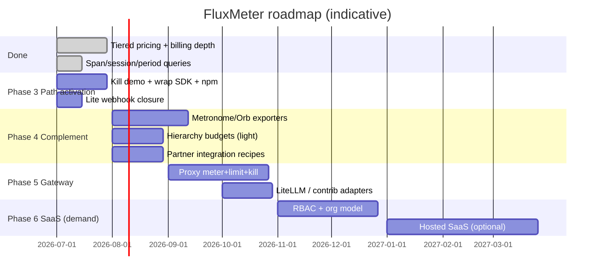

# FluxMeter Roadmap

Forward-looking plan for the FluxMeter project. **Website:** [fluxmeter.dev](https://fluxmeter.dev). For **what shipped**, see [changLog.md](changLog.md). For **milestone checklists**, see [progress.md](progress.md). For **architecture intent**, see [docs/DESIGN.md](docs/DESIGN.md). For **industry calibration**, see [docs/industry-billing-research-2026.md](docs/industry-billing-research-2026.md).

**Current version:** 2.7.0 (engine) · 1.4.0 (Python SDK on PyPI) · 1.3.0 (JS SDK pack-ready)  
**Active phase:** Phase 4 — Complementary export (v2.8)  
**Last updated:** 2026-07-06

---

## Vision

Become the **open source standard** for real-time AI token metering and budget enforcement — streaming-first, self-hostable, and provider-agnostic. Compete on sub-second guardrails and exactly-once financial correctness, not on being another analytics dashboard.

**North star:** A developer runs `make demo`, integrates once (`wrap` / proxy), and never wakes up to a runaway agent bill — without remembering to call `check` on every path.

**Positioning (vs Lago / Orb / Flexprice / gateway+OpenMeter):** those products close the loop to **invoice**; FluxMeter owns the gap from `response.usage` to **sub-second guardrail** (check / hold / kill). We meter and enforce; platforms invoice.

**Ultimate goal:** Become the open-source **runtime control plane** that Metronome / Stripe / Orb *need but do not own* — so they notice FluxMeter as the complementary standard (and potential acquisition / partnership surface), not as a competing invoicing engine.

---

## Priority principle (2026-07 calibration)

Industry cases (Cursor/Copilot spend limits, LiteLLM hierarchy budgets, OpenAI auth-style access engines, SpendGuard reserve/commit, Kong/OpenMeter prepaid, API resellers) converge on **pre-call hard deny + prepaid wallet + reserve/reconcile**. FluxMeter **already ships that financial core**.

The gap is not “another pricing feature” — it is **path activation** (wrap / proxy so enforcement is default) and **complementary export** (invoice SoR stays elsewhere). Full multi-tenant SaaS RBAC is **demand-gated**, not the next P0.

```text
Built ✓     → financial gate (check, reserve, wallet, packages, tiers, exactly-once)
Next        → make it unavoidable on the hot path + ping invoice platforms
Later       → deepen SaaS admin / hosted only if customers pull
```

Full case map and capability scoring: [docs/industry-billing-research-2026.md](docs/industry-billing-research-2026.md).

---

## Competitive map: Metronome · Stripe · Orb

Industry axis that matters for AI:

```
Invoice-based (meter now, bill later)     Real-time (authorize → debit → allow/deny)
Metronome · Orb · Lago · Stripe Meters      Credyt · Stigg · AgentBudget · FiGuard
                                              ↑ FluxMeter target zone
```

### How they work

| Company | What they actually do | Strength | Structural gap |
|---|--------|----------|--------------|
| **Metronome** (now a Stripe product) | Ingest raw events → SQL billable metrics → rate cards → contracts → invoice; Stripe collects payment/tax/rev-rec | Billions of events; enterprise commits/true-ups; OpenAI/Anthropic-scale | **Not** a pre-execution hard stop for agent loops; not open-source; not self-hosted; not mid-stream kill |
| **Orb** | Raw event store + query-time metrics; pricing simulation; prepaid credit ledgers; backdate/re-rate | Metric redefinition without re-ingest; agent credit ledgers; audit trail | App must poll balance / enforce access itself; no streaming kill; not open-source core |
| **Stripe Billing / Meters** | Subscription + meters; payments/tax; LLM token billing (preview) via AI Gateway + markup | Payments + tax + AI Gateway path; auto model price sync | 20-item subscription limit; basic meters ≠ AI-scale; Metronome is the “real” UBB product; gateway credit reject is gated/preview |
| **Kong + OpenMeter** | Gateway traffic → metering → prepaid wallets → invoice | Path + monetization in one vendor | Hard gateway auto-enforce of entitlements still incomplete (webhook-to-app pattern); not FluxMeter’s exactly-once financial core |

### What they all optimize for

```
[your app] --events--> [Metronome/Orb/Stripe] --invoice--> [customer pays]
```

They win at: **rating, contracts, invoices, money movement**.

They systematically under-invest in (or leave to the app):

1. **Pre-flight hard deny** before the LLM call burns money  
2. **Mid-stream kill** when a streaming response exceeds hold  
3. **Agent hierarchy budgets** (parent run → child tools → concurrent agents)  
4. **Open, self-hosted** high-throughput metering with exactly-once semantics  
5. **Provider-agnostic runtime** that sits *in front of* their event APIs  

That gap is FluxMeter’s blue ocean: **Runtime Guardrail + Metering Fabric**, not “another Metronome.”

### How to get them to notice (strategy, not vanity)

| Lever | Why it works |
|------|------|
| **Complement, don’t replace** | Ship first-class exporters: FluxMeter → Metronome / Orb / Stripe Meters. Their customers keep invoices; you own the hot path. |
| **Own the demo they cannot ship open-source** | Mid-stream kill + `<10ms` check GIF that every AI agent builder retweets. |
| **Become the default open meter** | Spec + wrap SDK + gateway path so “send to Metronome/Orb” starts from FluxMeter. |
| **Speak their language** | Docs: “FluxMeter → Metronome/Orb/Stripe” recipes; HN/Show HN framed as *runtime*, not *billing*. |
| **Avoid their moat** | No multi-year commits UI, no ASC 606, no payment collection. Stay boring there. |

---

## Where we are today

| Layer | Status | Notes |
|-------|--------|-------|
| **Lite path** (default) | Shipped | API → Redis Lua; rollup worker; period/day/session/span queries; Stripe export |
| **Full path** (Flink) | Shipped | 1M eps bursts; span attribution; month/day rollup in RedisSink; DLQ; Kafka kill alerts |
| **Financial core** | Shipped | `check`, `reserve`/`reconcile`, prepaid USD + token packages, tiered pricing, re-rate |
| **SaaS scaffold** | Shipped | Control plane `:8001`; tenant CRUD + plan limits; not a hosted product |
| **Open spec** | Shipped | `spec/schema`, OpenAPI, semantic conventions |
| **Python SDK** | Shipped | PyPI `fluxmeter` 1.3.0 (HTTP lite + Kafka full); `track_*`, no `wrap()` yet |
| **JS SDK** | In repo | `@fluxmeter/client` — not on npm yet |
| **Production ops** | Partial | Helm, DR runbook, Prometheus profile, reconciliation job |
| **Path activation** | Partial (2.7.0) | `wrap()`, Lite webhooks, hierarchy caps, kill demo; GIF / npm push optional |
| **Invoice exporters** | Partial | Stripe Meters stub; no Metronome/Orb production export |

### Deployment paths

```
Lite (make demo)     →  side projects, <100K eps, zero Flink ops
Full (make demo-full) →  100K–1M eps, spans, DLQ, Kafka alerts
SaaS (make start-saas) → multi-tenant product builders (scaffold)
```

---

## Roadmap overview



Timelines are **indicative**, not commitments. Sequence matters more than months: **path → export → gateway productization → SaaS depth**.

---

## Phase 1 — v2.3: Polish & correctness ✓

**Target release:** 2.2.2 ✓ (2026-07-04)

---

## Phase 2 — v2.4–2.6: Billing depth ✓

**Goal:** Production-grade pricing and export without a hosted SaaS.  
**Shipped:** 2.4.0 (tiers) · 2.5.0 (export/packages/checkout) · 2.6.x (period/day/session/span + China models)

| Item | Priority | Success criteria | Status |
|------|----------|------------------|--------|
| **Tiered pricing in engine** | P0 | Integration test per tier boundary | ✓ 2.4.0 |
| Stripe Checkout wiring | P1 | Test mode E2E | ✓ 2.5.0 (mock + endpoint) |
| Calendar-aligned billing windows | P2 | Hourly + monthly export modes | ✓ 2.5.0 |
| Cost-based Stripe export | P2 | Config flag | ✓ `STRIPE_EXPORT_MODE=cost` |
| Credits / prepaid packages | P2 | API + docs | ✓ `/budget/{id}/package` |
| Period / day / session queries | P2 | Lite + Full readers | ✓ 2.6.1 |
| Lite span aggregation | P2 | `parentSpanId` on Lite ingest | ✓ 2.6.2 |

**Follow-ups (backlog, not Phase 3 blockers):** Kafka replay job for tier re-rating; Stripe Checkout live E2E with test keys; span-level tier pricing; provider invoice reconcile polish; COGS vs sell dual ledger (reseller margin).

---

## Phase 3 — v2.7: Path activation & narrative (**active**)

**Goal:** Make existing financial core **default on the hot path** and **viscerally demonstrable**. Industry calibration: gate exists; adopter friction is “must remember `check`” and Lite alert path is incomplete.

| Item | Priority | Description | Success criteria | Status |
|------|----------|-------------|------------------|--------|
| **Mid-stream kill demo** | P0 | Thin SDK path: reserve → stream → `StreamKilledError`; runnable demo | Kill on overrun; `demos/path_activation_demo.py` | ✓ 2.7.0 |
| **Wrap SDK** | P0 | `wrap(OpenAI())` (Python): pre-call `check`, post-call `track`, fail-open | One-liner; fail-open on API outage | ✓ SDK 1.4.0 |
| **npm publish** `@fluxmeter/client` | P0 | Parity with Python HTTP transport | Package on npm | Pack + workflow ready; needs `NPM_TOKEN` secret |
| **Lite budget webhook** | P0 | Fire `BUDGET_LOW` / `BUDGET_EXHAUSTED` without Kafka | Lite ingest triggers HTTPS webhook | ✓ 2.7.0 |
| Light hierarchy caps | P1 | Parent span / session **hard** max spend at `check` | Children cannot exceed parent cap | ✓ 2.7.0 |
| Soft alert thresholds | P2 | 70% / 90% warn ladder beyond `alert_threshold_usd` | `BUDGET_WARN` events | ✓ 2.7.0 |

**Phase 3 closed.** Optional: `npm publish` when registry credentials available; marketing kill GIF.

**Non-goals for v2.7:** Full RBAC admin UI; hosted cloud; outcome / Flex-Credit SKUs.

---

## Phase 4 — v2.8: Complementary export & agent budgets

**Goal:** Own the runtime they plug into — export to invoice SoR; harden agent-style hierarchy without becoming Stigg/Metronome.

```
[Agent / App / wrap / proxy]
     │
     ▼
[FluxMeter: check → hold → meter → kill]   ← we own this (open, self-hosted, <10ms)
     │
     ├── events (normalized) ──► Metronome / Orb / Stripe Meters  ← they own invoice
     └── kill / deny ──► stop burning tokens
```

| Item | Priority | Description | Success criteria |
|------|----------|-------------|------------------|
| **Metronome / Orb / Stripe exporters** | P0 | Production event export beyond Stripe stub | Recipe + integration test with mock sink |
| **Partner docs** | P0 | `docs/integrations/metronome.md`, `orb.md`, `stripe.md` copy-paste recipes | Cold-start in one afternoon |
| **Agent hierarchy budgets** | P0 | Parent → child reserve-confirm; optional concurrent agent pool | Tests for over-parent deny |
| Per-key / API-key budgets | P1 | Reseller pattern (daily/monthly cap per key, SmarToken-like) | Key scope on `check` |
| Feature / workflow attribution | P1 | Persist whitelist `metadata` dims; query by dim | `room_id` / `feature` slice queries |
| Open token-event interop | P1 | Stable mapping 1:1 to Metronome/Orb event shapes | Spec appendix |

**Success metric for “noticed” (qualitative):**

1. A public integration guide appears in *their* docs or partner directory, **or**
2. HN/Twitter discourse: “use FluxMeter for runtime, Metronome/Orb for invoice”, **or**
3. Direct outreach / partnership / acquisition conversation about the runtime layer.

---

## Phase 5 — v3.x: Gateway path — meter, limit, kill

**Goal:** Productize the Phase 3 demo into a deployable **traffic path** that meters, enforces, and kills mid-stream — the story Metronome/Orb cannot open-source. Builds on existing `check` / `reserve` / kill; not greenfield.

| Item | Priority | Description | Success criteria |
|------|----------|-------------|------------------|
| **Streaming / AI proxy** | P0 | HTTP proxy between app and provider; captures `usage`, emits FluxMeter events | Demo: proxy-only ingest (no app-side `track_*`) |
| Pre-request limit on proxy | P0 | Proxy calls budget check (or local hold) before forwarding | Exhausted customer never hits provider |
| Mid-response budget kill | P0 | Terminate stream when cost exceeds hold / alert | Latency &lt; 1s from alert |
| Inference gateway adapters | P1 | LiteLLM / Kong-style hooks in `contrib/` | At least one runnable example |
| TPM limits | P1 | Token-per-minute alongside RPM (gateway norm) | Config + tests |
| Predictive cost estimation | P2 | Sliding-window spend rate → early warn | Optional side job |

Reference: original DESIGN “Approach C” deferred item #18.

---

## Phase 6 — Multi-tenant SaaS (**demand-gated**)

**Goal:** Turn the control plane scaffold into a credible self-hosted SaaS backend **when a real multi-tenant operator needs it**. Hierarchy *budgets* (Phase 4) are not the same as full org RBAC admin.

| Item | Priority | Description | Success criteria |
|------|----------|-------------|------------------|
| **Full multi-tenant RBAC** | P0* | Org → tenant → customer hierarchy; role-based admin | API + control plane tests |
| Per-tenant API routing | P1 | Tenant API keys enforce scope on ingest/check/usage | 403 on cross-tenant access |
| Plan enforcement | P1 | Hard-stop ingest when `max_eps` / monthly cap exceeded | `test_control_plane.py` extended |
| Tenant usage dashboard | P2 | Grafana dashboard template per tenant | Provisioning doc |
| Postgres metadata store | P2 | Move `cp:tenant:*` from Redis to durable store (optional) | Migration guide |
| Stripe multi-tenant billing | P2 | Per-tenant Stripe customer + meter mapping | Admin API |

\*P0 only after an explicit self-host SaaS customer or operator asks for it.

**Non-goal:** Fully managed hosted FluxMeter cloud unless community demand (separate, optional).

---

## Phase 7 — Platform & distribution (long-term)

| Item | Priority | Description |
|------|----------|-------------|
| GHCR images | P2 | Pre-built API + Flink job images on release tags |
| Hosted SaaS (optional) | P3 | Managed Lite/Full tiers — only if community demand; still export to invoice SoR |
| Flink SQL / Table API port | P3 | Alternative job authoring for ops teams |
| Multi-region active-active | P3 | Kafka + Redis global; documented trade-offs |

---

## Ecosystem track (ongoing)

Parallel to version phases — grows the OpenCore surface without coupling to engine releases.

| Track | Items |
|-------|-------|
| **Spec** | Keep v1 stable; optional `feature` / `workflow` on events when attribution needs it (`token-event-v2` only if breaking) |
| **Wrap-once SDK** | Phase 3 deliverable; JS follows Python |
| **Feature attribution** | Phase 4 metadata dims |
| **Provider invoice reconcile** | Extend ops job: self events vs provider export deltas |
| **contrib/** | Provider adapters (Bedrock, Azure, Vertex), community pricing; optional markup helpers (not auto-invoice) |
| **Integrations** | 1) Stripe / Metronome export 2) Orb ingest 3) Lago / OpenMeter — FluxMeter = guardrail SoR |
| **ClickHouse baseline** | Keep benchmark honest vs store-then-query |
| **Community** | SHOW HN as *runtime guardrail*; “FluxMeter + Metronome/Orb” cookbook; LangChain/LiteLLM examples |

---

## Explicit non-goals (for now)

- Replacing Metronome / Orb / Stripe Billing / Kong Metering as **invoice / contract / payment SoR**
- Multi-year commits, true-ups, ASC 606, Merchant of Record
- Flex Credit / AWU / outcome SKUs as a product surface (map in outer app if needed)
- Full Helicone-class observability / cost-based routing
- Supporting non-token billing (API calls, storage GB) in core engine — use contrib connectors
- PyFlink rewrite of Java engine
- Guaranteed 1M eps on laptop docker-compose sustained (local Redis is the bottleneck)

---

## How to use this doc

| Audience | Start here |
|----------|------------|
| New contributor | [README.md](README.md) → `make demo` → **Phase 3** |
| Billing engineer | [docs/pricing-hybrid-paths.md](docs/pricing-hybrid-paths.md) → Phase 2 (done) |
| Adopter / agent builder | **Phase 3** wrap + kill demo |
| Invoice platform integrator | **Phase 4** exporters + partner docs |
| SaaS builder | [docs/control-plane-api.md](docs/control-plane-api.md) → **Phase 6** (when needed) |
| Ops / SRE | [docs/disaster-recovery.md](docs/disaster-recovery.md) → Phase 7 GHCR |
| Strategy / research | [docs/industry-billing-research-2026.md](docs/industry-billing-research-2026.md) + **Competitive map** |

**Propose changes:** Open an issue with `roadmap` label or PR that updates this file + `progress.md` checklist row.

---

## Version mapping (planned)

| Release | Theme | Engine | Python SDK |
|---------|-------|--------|------------|
| **2.7.0** ✓ | Path activation: wrap, Lite webhook, hierarchy, kill demo | 2.7.0 | 1.4.0 |
| **2.6.2** ✓ | Lite span + billing queries | 2.6.2 | 1.3.0 |
| **2.5.0** ✓ | Phase 2 billing depth | 2.5.0 | 1.2.0 |
| **2.4.0** ✓ | Tiered pricing | 2.4.0 | 1.1.x |
| **2.2.2** ✓ | Phase 1 polish | 2.2.2 | 1.1.0 |
| **2.8.0** | Exporters + agent hierarchy budgets | 2.8.0 | 1.5.0 |
| **3.0.0** | Gateway path: meter + limit + mid-flight kill | 3.0.0 | 2.0.0 |
| **3.1.0+** | Multi-tenant SaaS backend (demand-gated) | 3.1.0 | 2.1.0 |

SDK and engine versions are **independent semver**; table shows intended alignment milestones only.
