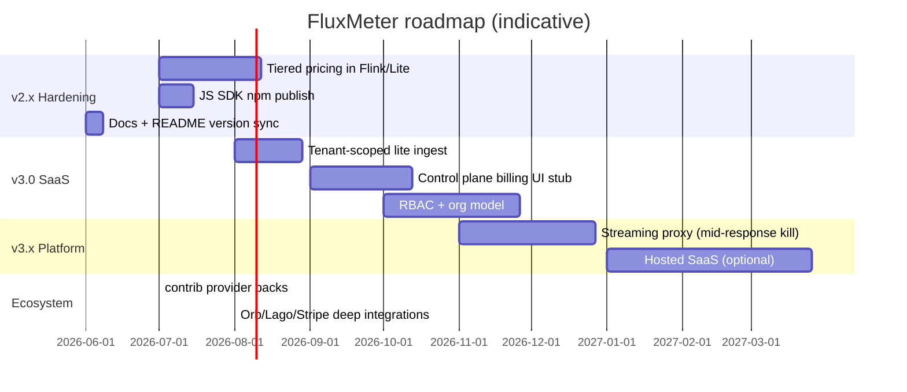

# FluxMeter Roadmap

Forward-looking plan for the FluxMeter project. For **what shipped**, see [changLog.md](changLog.md). For **milestone checklists**, see [progress.md](progress.md). For **architecture intent**, see [docs/DESIGN.md](docs/DESIGN.md).

**Current version:** 2.2.2 (engine) · 1.1.0 (Python SDK on PyPI)  
**Last updated:** 2026-07-04

---

## Vision

Become the **open source standard** for real-time AI token metering and budget enforcement — streaming-first, self-hostable, and provider-agnostic. Compete on sub-second guardrails and exactly-once financial correctness, not on being another analytics dashboard.

**North star:** A developer runs `make demo`, calls `GET /budget/{id}/check` before every LLM request, and never wakes up to a runaway agent bill.

---

## Where we are today

| Layer | Status | Notes |
|-------|--------|-------|
| **Lite path** (default) | Shipped | API → Redis Lua; rollup worker; Stripe Meters export |
| **Full path** (Flink) | Shipped | 1M eps bursts; span attribution; DLQ; budget kill signals |
| **SaaS scaffold** | Shipped | Control plane `:8001`; tenant CRUD + plan limits; not a hosted product |
| **Open spec** | Shipped | `spec/schema`, OpenAPI, semantic conventions |
| **Python SDK** | Shipped | PyPI `fluxmeter` 1.1.0 (HTTP lite + Kafka full) |
| **JS SDK** | In repo | `@fluxmeter/client` — not on npm yet |
| **Production ops** | Partial | Helm, DR runbook, Prometheus profile, reconciliation job |
| **Tiered pricing engine** | Partial | Schema exists; runtime uses first tier only |

### Deployment paths

```
Lite (make demo)     →  side projects, <100K eps, zero Flink ops
Full (make demo-full) →  100K–1M eps, spans, DLQ, Kafka alerts
SaaS (make start-saas) → multi-tenant product builders
```

---

## Roadmap overview



Timelines are **indicative**, not commitments.

---

## Phase 1 — v2.3: Polish & correctness (near-term)

**Goal:** Close gaps between docs, tests, and runtime; make Lite the obvious default DX.

| Item | Priority | Description | Success criteria | Status |
|------|----------|-------------|------------------|--------|
| README / SHOW_HN version sync | P0 | Align marketing docs with engine version + dual-path story | README badge matches `build.gradle`; SHOW_HN synced | ✓ 2.2.2 |
| `make test-unit` expansion | P1 | Single command for all no-Docker Python + Java unit tests | Documented in Makefile | ✓ |
| OpenAPI 2.2.x completeness | P1 | Lite ingest responses, `link-stripe`, health `mode` | `validate-spec.sh` passes | ✓ |
| Lite tenant key isolation | P2 | Honor `tenantId` in lite Lua paths (today: Flink only) | E2E test with tenant prefix | ✓ |
| AggregationKeys in mainline | P1 | Commit `AggregationKeys.java` + unit tests (if not merged) | `make test-java` green | ✓ |
| Local load-test profile docs | P2 | Document ~25K sustained @ 50K target on Mac docker | `docs/load-testing.md` | ✓ |

**Target release:** 2.2.2 ✓ (2026-07-04) — tiered pricing remains Phase 2 / 2.4.0

---

## Phase 2 — v2.4: Billing depth (near-term)

**Goal:** Production-grade pricing and export without a hosted SaaS.

| Item | Priority | Description | Success criteria |
|------|----------|-------------|------------------|
| **Tiered pricing in engine** | P0 | Monthly volume tracking; apply correct tier in Flink + lite | Integration test per tier boundary |
| Stripe Checkout wiring | P1 | Control plane `stripe_billing.py` → real subscription flow | Test mode E2E |
| Calendar-aligned billing windows | P2 | Align rollup / export to billing period boundaries | Hourly + monthly export modes |
| Cost-based Stripe export | P2 | Option to report `cost_usd` deltas, not just event counts | Config flag |
| Credits / prepaid packages | P2 | First-class “package drawdown” beyond flat balance | API + docs |

---

## Phase 3 — v3.0: Multi-tenant SaaS (medium-term)

**Goal:** Turn the control plane scaffold into a credible self-hosted SaaS backend.

| Item | Priority | Description | Success criteria |
|------|----------|-------------|------------------|
| **Full multi-tenant RBAC** | P0 | Org → tenant → customer hierarchy; role-based admin | API + control plane tests |
| Per-tenant API routing | P1 | Tenant API keys enforce scope on ingest/check/usage | 403 on cross-tenant access |
| Plan enforcement | P1 | Hard-stop ingest when `max_eps` / monthly cap exceeded | `test_control_plane.py` extended |
| Tenant usage dashboard | P2 | Grafana dashboard template per tenant | Provisioning doc |
| Postgres metadata store | P2 | Move `cp:tenant:*` from Redis to durable store (optional) | Migration guide |
| Stripe multi-tenant billing | P2 | Per-tenant Stripe customer + meter mapping | Admin API |

**Non-goal for v3.0:** Fully managed hosted FluxMeter cloud (see Phase 5).

---

## Phase 4 — v3.x: Real-time kill & proxy (medium-term)

**Goal:** Architecturally impossible-without-streaming demo — cut LLM streams mid-flight.

| Item | Priority | Description | Success criteria |
|------|----------|-------------|------------------|
| **Streaming proxy** | P0 | HTTP proxy between app and provider; respects budget-alerts | Demo GIF |
| Mid-response budget kill | P0 | Terminate stream when window cost exceeds hold | Latency < 1s from alert |
| Inference gateway adapters | P1 | LiteLLM / custom gateway hooks | Example in `contrib/` |
| Predictive cost estimation | P2 | Sliding-window spend rate → early warn | Optional Flink side job |

Reference: original DESIGN “Approach C” deferred item #18.

---

## Phase 5 — Platform & distribution (long-term)

| Item | Priority | Description |
|------|----------|-------------|
| **npm publish** `@fluxmeter/client` | P1 | Parity with Python SDK 1.1.0 HTTP transport |
| GHCR images | P2 | Pre-built API + Flink job images on release tags |
| Hosted SaaS (optional) | P3 | Managed Lite/Full tiers — only if community demand |
| Flink SQL / Table API port | P3 | Alternative job authoring for ops teams |
| Multi-region active-active | P3 | Kafka + Redis global; documented trade-offs |

---

## Ecosystem track (ongoing)

Parallel to version phases — grows the OpenCore surface without coupling to engine releases.

| Track | Items |
|-------|-------|
| **Spec** | `token-event-v2` only when breaking; keep v1 stable |
| **contrib/** | Provider adapters (Bedrock, Azure, Vertex), community pricing tables |
| **Integrations** | Deep guides for Lago, OpenMeter, Orb, Metronome, Zuora ([docs/integrations.md](docs/integrations.md)) |
| **ClickHouse baseline** | Keep benchmark honest vs store-then-query |
| **Community** | SHOW HN / launch, example apps, “FluxMeter + LangChain” cookbook |

---

## Explicit non-goals (for now)

- Replacing Stripe/Lago/Orb as **system of record** for invoicing — FluxMeter meters; platforms invoice
- Supporting non-token billing (API calls, storage GB) in core engine — use contrib connectors
- PyFlink rewrite of Java engine
- Guaranteed 1M eps on laptop docker-compose sustained (local Redis is the bottleneck)

---

## How to use this doc

| Audience | Start here |
|----------|------------|
| New contributor | [README.md](README.md) → `make demo` → this roadmap **Phase 1** |
| Billing engineer | [docs/DESIGN.md](docs/DESIGN.md) → **Phase 2** tiered pricing |
| SaaS builder | [docs/control-plane-api.md](docs/control-plane-api.md) → **Phase 3** |
| Ops / SRE | [docs/disaster-recovery.md](docs/disaster-recovery.md) → **Phase 5** GHCR |

**Propose changes:** Open an issue with `roadmap` label or PR that updates this file + `progress.md` checklist row.

---

## Version mapping (planned)

| Release | Theme | Engine | Python SDK |
|---------|-------|--------|------------|
| **2.2.2** ✓ | Phase 1 polish (docs, tests, OpenAPI, lite tenant keys) | 2.2.2 | 1.1.0 |
| **2.2.1** ✓ | Dual-path + CTO follow-up | 2.2.1 | 1.1.0 |
| **2.3.0** | Reserved (Phase 1 landed in 2.2.2) | — | 1.1.x |
| **2.4.0** | Tiered pricing + Stripe depth | 2.4.0 | 1.2.0 |
| **3.0.0** | Multi-tenant SaaS backend | 3.0.0 | 2.0.0 |
| **3.1.0** | Streaming proxy + mid-flight kill | 3.1.0 | 2.1.0 |

SDK and engine versions are **independent semver**; table shows intended alignment milestones only.
