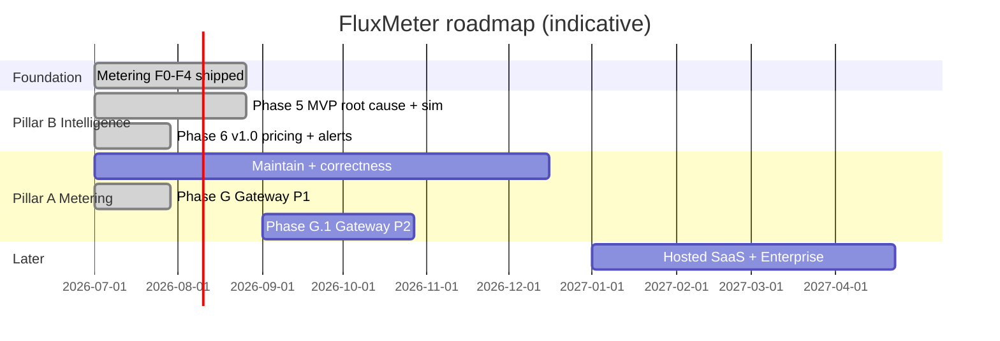

# FluxMeter Roadmap

Forward-looking plan for the FluxMeter project. **Website:** [fluxmeter.dev](https://fluxmeter.dev). For **what shipped**, see [changLog.md](changLog.md). For **milestone checklists**, see [progress.md](progress.md). For **architecture intent**, see [docs/DESIGN.md](docs/DESIGN.md). For **industry calibration**, see [docs/industry-billing-research-2026.md](docs/industry-billing-research-2026.md). For **pivot rationale**, see [docs/superpowers/specs/2026-07-11-intelligence-pivot-design.md](docs/superpowers/specs/2026-07-11-intelligence-pivot-design.md).

**Current version:** 3.2.0 (engine) · 1.5.0 (Python SDK) · 1.3.0 (JS SDK pack-ready)  
**Active phase:** Phase 7+ (demand-gated) · **Pillar B Intelligence complete** (3.0–3.1) · Pillar A metering (**maintained** · Gateway P1 ✓)  
**Last updated:** 2026-07-11

---

## Vision

Become the open-source **AI Monetization Platform** — **Layer 3 metering + guardrail** *and* **Layer 4 monetization intelligence** in one stack.

**North star:** A Founder / Finance / RevOps user connects their observability + billing data (or FluxMeter native ingest) and within 30 minutes sees: *why* AI margin dropped, *which* customers lose money, and *what to do next* — with optional sub-second budget enforcement on the hot path.

**Market map (2026-07):**

```text
L1 Infra          → models + GPU (mature, red ocean)
L2 Observability  → traces, latency, evals (Langfuse, Helicone, LangSmith…)
L3 Metering       → usage → invoice (OpenMeter, Lago, Metronome, Orb…)
L4 Intelligence   → why margin dropped + what to do (blue ocean)  ← product narrative
```

**Positioning:**

> OpenMeter tells you what happened.  
> FluxMeter tells you what to do next.

FluxMeter **owns Layer 3 execution** (real-time meter, check, reserve, kill, export) **and** **Layer 4 decision** (root cause, unit economics, simulation, pricing intelligence). Observability and invoice platforms stay complementary — overlay ingest, not replace.

**Monetization:** Intelligence + metering **fully open source**; revenue from **Hosted SaaS**, dedicated onboarding, and enterprise support.

---

## Dual-pillar model

Product narrative shifts to Layer 4; **metering is not deprecated** — it remains a first-class, maintained pillar that feeds Intelligence and optionally enforces on the hot path.

```text
┌─────────────────────────────────────────────────────────────┐
│  Pillar A — Metering & Guardrail (Layer 3) · ONGOING        │
│  Lite/Full ingest · pricing · check/reserve/kill · export   │
│  Maintained + evolved (Gateway side track)                  │
└───────────────────────────┬─────────────────────────────────┘
                            │ native usage + cost data
                            ▼
┌─────────────────────────────────────────────────────────────┐
│  Pillar B — Monetization Intelligence (Layer 4) · SHIPPED (MVP) │
│  Root cause · unit economics · simulation · pricing intel   │
│  Overlay: Langfuse / OpenMeter / Helicone + native FluxMeter│
└─────────────────────────────────────────────────────────────┘
```

| Pillar | What it solves | Primary audience | Status |
|--------|----------------|------------------|--------|
| **A — Metering & Guardrail** | Can we meter, bill, and stop runaway spend? | Engineering, billing ops | **Shipped** (F0–F4 + Gateway P1 3.2.0); maintained |
| **B — Intelligence** | Can we make money? Why did margin drop? | Founder, Finance, RevOps, Product | **Done** (3.0 MVP + 3.1 v1.0); no further feature track |

**Priority principle:**

```text
Shipped ✓   → Intelligence MVP + v1.0 (3.0–3.1); metering + Gateway P1 (3.2.0)
Maintain    → Lite/Full engine, SDK, exporters, correctness — every release
Demand-gated→ Phase 7+ (Hosted SaaS, NL agent, enterprise) — only if traction
Optional    → Gateway P2, Langfuse overlay, ecosystem cookbooks — backlog, not active
```

---

## Competitive map

Industry axis that matters for AI:

```
Invoice-based (meter now, bill later)     Real-time (authorize → debit → allow/deny)
Metronome · Orb · Lago · Stripe Meters      Credyt · Stigg · AgentBudget · FiGuard
                                              ↑ FluxMeter metering pillar (Layer 3)

Observability (what ran?)                   Decision (why margin? what next?)
Langfuse · Helicone · LangSmith               Finout · Vantage · (sparse dedicated)
                                              ↑ FluxMeter intelligence pillar (Layer 4)
```

### Layer 3 — how we complement invoice platforms

| Company | Strength | FluxMeter metering role |
|---------|----------|-------------------------|
| **Metronome / Orb / Stripe** | Contracts, rating, invoices | Export normalized events; own pre-call deny + mid-stream kill |
| **OpenMeter / Lago** | Product catalog, subscriptions | Overlay ingest for Intelligence; optional export target |
| **Langfuse / Helicone** | Traces, latency, prompt ops | Overlay ingest for attribution dims Intelligence needs |

**Complement, don't replace:** FluxMeter → Metronome/Orb/Stripe recipes stay; Intelligence reads from both native meter and external overlays.

---

## Where we are today

### Pillar A — Metering & Guardrail ✓ (Foundation F0–F4)

| Layer | Status | Notes |
|-------|--------|-------|
| **Lite path** (default) | Shipped | API → Redis Lua; rollup worker; period/day/session/span queries; Stripe export |
| **Full path** (Flink) | Shipped | 1M eps bursts; span attribution; month/day rollup; DLQ; Kafka kill alerts |
| **Financial core** | Shipped | `check`, `reserve`/`reconcile`, prepaid USD + token packages, tiered pricing, re-rate |
| **Path activation** | Shipped | `wrap()`, Lite webhooks, hierarchy caps, kill demo (2.7.0) |
| **Invoice exporters** | Shipped | Stripe / Metronome / Orb (2.8.0) |
| **Open spec + SDKs** | Shipped | `spec/schema`, OpenAPI; Python 1.5.0 PyPI; JS pack-ready |
| **SaaS scaffold** | Shipped | Control plane `:8001`; demand-gated for full RBAC |
| **Production ops** | Partial | Helm, DR runbook, Prometheus profile, reconciliation job |
| **Gateway proxy** | Shipped | OpenAI-compatible proxy `:8080`; check + kill + proxy-only ingest (3.2.0) |

### Pillar B — Intelligence ✓ **complete (MVP scope)**

| Capability | Status | Version |
|------------|--------|---------|
| Root Cause Analysis | Shipped | 3.0.0 |
| Unit Economics + recommendations | Shipped | 3.0.0 |
| Scenario Simulation (≥3 types) | Shipped | 3.0.0 |
| Overlay: OpenMeter | Shipped | 3.0.0 |
| Pricing Optimizer / Profitability / Forecast / Alerts / Report | Shipped | 3.1.0 |

Docs: [`docs/intelligence-api.md`](docs/intelligence-api.md)

**Out of MVP scope (backlog only):** Langfuse/Helicone overlays, dedicated Helm for Intelligence, partner cookbooks — revisit only with user demand.

### Deployment paths (metering — unchanged)

```text
Lite (make demo)      →  side projects, <100K eps, zero Flink ops (+ Gateway :8080)
Full (make demo-full) →  100K–1M eps, spans, DLQ, Kafka alerts
SaaS (make start-saas)→  multi-tenant product builders (scaffold)
```

---

## Roadmap overview



Timelines are **indicative**. **Intelligence (Pillar B) is complete at 3.1.0** for the agreed MVP scope; forward work is metering maintenance and demand-gated Phase 7+.

---

## Foundation (F0–F4) — Metering pillar shipped ✓

Historical phases — **capabilities remain first-class**; see [changLog.md](changLog.md) for release detail.

| Phase | Theme | Engine | Status |
|-------|-------|--------|--------|
| **F0–F1** | Core pipeline, polish, tests | 2.2.x | ✓ |
| **F2** | Tiered pricing, export, packages, billing queries | 2.4–2.6 | ✓ |
| **F3** | Path activation: wrap, kill demo, webhook, hierarchy | 2.7.0 | ✓ |
| **F4** | Metronome/Orb/Stripe export, agent budgets, dims | 2.8.0 | ✓ |

**Ongoing metering maintenance (every release):** correctness tests, pricing catalog updates, exporter fixes, SDK parity, Lite/Full regression — not optional.

---

## Phase 5 — Intelligence MVP ✓

**Goal:** Validate PMF — prescriptive insights + simulation for non-engineers.  
**Shipped:** 3.0.0 — see [changLog.md](changLog.md) and [docs/intelligence-api.md](docs/intelligence-api.md).

| Item | Priority | Description | Status |
|------|----------|-------------|--------|
| **Root Cause Analysis** | P0 | Auto-explain spend deltas by model, agent, team, customer | ✓ 3.0.0 |
| **Unit Economics** | P0 | Revenue vs cost, margin, loss alerts + recommendations | ✓ 3.0.0 |
| **Scenario Simulation** | P0 | What-if: model switch / prompt / token promo (≥3 types) | ✓ 3.0.0 |
| **Dual-source ingest** | P0 | Native + OpenMeter overlay | ✓ 3.0.0 |
| Prescriptive summary page | P1 | Finance/CEO view | ✓ 3.0.0 (unit economics + report) |
| Landing realignment | P1 | Layer 4 narrative | ✓ README + intelligence-api docs |

---

## Phase G — Gateway side track (metering evolution · parallel)

**Goal:** Productize proxy path — meter, limit, mid-flight kill — **without blocking Phase 5**.  
Builds on shipped `check` / `reserve` / kill demo; extends **Pillar A**, not Intelligence.

| Item | Priority | Description | Success criteria | Status |
|------|----------|-------------|------------------|--------|
| Streaming / AI proxy | P1 | HTTP proxy; captures `usage`, emits FluxMeter events | Demo: proxy-only ingest | ✓ 3.2.0 |
| Pre-request limit on proxy | P1 | Budget check before forward to provider | Exhausted customer never hits provider | ✓ 3.2.0 |
| Mid-response budget kill | P1 | Terminate stream on hold overrun | Latency < 1s from alert | ✓ 3.2.0 |
| LiteLLM / contrib adapters | P2 | Hooks in `contrib/` | One runnable example | Planned |
| TPM limits | P2 | Token-per-minute alongside RPM | Config + tests | Planned |
| Predictive cost estimation | P2 | Sliding-window spend rate → early warn | Optional side job | Planned |

**Release:** Gateway P1 shipped as **3.2.0** — [`docs/gateway.md`](docs/gateway.md).

---

## Phase 6 — Intelligence v1.0 (paid conversion core) ✓

| Item | Priority | Description | Status |
|------|----------|-------------|--------|
| **Pricing Optimizer** | P0 | Historical-data pricing recommendations + ROI forecast | ✓ 3.1.0 |
| **Profitability Dashboard** | P0 | Cross-customer / product margin overview + trends | ✓ 3.1.0 |
| **Anomaly Alerts + Recommendations** | P0 | Push alerts + simple workflow (e.g. notify Finance) | ✓ 3.1.0 |
| **Basic Forecasting** | P1 | AI spend forecast vs budget alignment | ✓ 3.1.0 |
| **Export / Sharing** | P1 | Finance / CEO report export | ✓ 3.1.0 (`GET /intelligence/report`) |

---

## Phase 7+ — platform & commercial (**demand-gated · active when traction**)

| Item | Priority | Description |
|------|----------|-------------|
| NL Agent queries | P2 | "Which customer is most profitable?" |
| Automated Optimization | P2 | Model routing / prompt cost suggestions |
| A/B Pricing Experiment Tracking | P2 | Tie promos to margin outcomes |
| Enterprise (SSO, RBAC, FOCUS, compliance) | P2 | Demand-gated |
| **Hosted SaaS** | P2 | Managed Intelligence + connectors — primary commercial surface; candidate **4.0.0** if built |
| Multi-tenant SaaS backend | P2 | Full org RBAC when operator demand appears |

---

## Metering maintenance track (ongoing · Pillar A)

Parallel to version phases — **required**, not backlog.

| Track | Items |
|-------|-------|
| **Correctness** | Exactly-once, idempotency, tier boundaries, `make test-java` / `make test-lite` green |
| **Pricing** | Catalog updates (incl. China/contrib), re-rate job polish |
| **SDK** | Python + JS parity; `wrap()` hardening; npm publish when creds available |
| **Export** | Metronome/Orb/Stripe recipe maintenance; interop spec |
| **Integrations** | Lago / OpenMeter as export or overlay targets |
| **Performance** | Lite load ceiling docs; Full 1M eps burst regression |
| **contrib/** | Provider adapters (Bedrock, Azure, Vertex); community pricing |

---

## Ecosystem track (ongoing)

| Track | Items |
|-------|-------|
| **Spec** | Keep v1 stable; `feature` / `workflow` dims for Intelligence attribution |
| **Overlay connectors** | Langfuse, Helicone, OpenMeter ingest → Intelligence layer |
| **Partner docs** | "FluxMeter Intelligence + OpenMeter/Langfuse" cookbooks |
| **ClickHouse baseline** | Honest store-then-query comparison |
| **Community** | SHOW HN as *monetization intelligence*; metering demo as proof of data quality |

---

## Explicit non-goals (for now)

- Replacing Langfuse / Helicone as full observability SoR
- Replacing Metronome / Orb / Stripe / OpenMeter as **invoice / contract / payment SoR**
- Multi-year commits, true-ups, ASC 606, Merchant of Record
- Helicone-class cost-based routing (defer to Phase 7+ Automated Optimization)
- Deprecating or freezing the metering engine — **Pillar A stays maintained**
- PyFlink rewrite of Java engine
- Further Intelligence feature polish beyond 3.1.0 MVP (Langfuse connector, extra dashboards) — **unless demand appears**
- Guaranteed 1M eps on laptop docker-compose sustained (local Redis bottleneck)
---

## How to use this doc

| Audience | Start here |
|----------|------------|
| New contributor | [README.md](README.md) → `make demo` → [docs/intelligence-api.md](docs/intelligence-api.md) |
| Billing / metering engineer | [docs/pricing-hybrid-paths.md](docs/pricing-hybrid-paths.md) → [docs/gateway.md](docs/gateway.md) |
| Adopter / agent builder | Gateway proxy (`:8080`) or F3 `wrap()` + kill demo |
| Finance / RevOps / Founder | [docs/intelligence-api.md](docs/intelligence-api.md) (shipped 3.0–3.1) |
| Invoice platform integrator | F4 exporters + [docs/integrations/](docs/integrations/) |
| Strategy / research | [docs/industry-billing-research-2026.md](docs/industry-billing-research-2026.md) + pivot spec |

**Propose changes:** Issue with `roadmap` label or PR updating this file + `progress.md`.

---

## Version mapping (planned)

| Release | Theme | Engine | Python SDK | Notes |
|---------|-------|--------|------------|-------|
| **2.8.0** ✓ | F4: export + hierarchy | 2.8.0 | 1.5.0 | Metering pillar baseline |
| **3.0.0** ✓ | Intelligence MVP | 3.0.0 | 1.5.0 | Product narrative → Layer 4; OpenMeter overlay |
| **3.1.0** ✓ | Intelligence v1.0 (features) | 3.1.0 | 1.5.0 | Optimizer, alerts, forecast, report |
| **3.2.0** ✓ | Gateway P1 (Metering) | 3.2.0 | 1.5.0 | Proxy + check + kill; Pillar A production path |
| **3.2.x** | Metering maintenance + Gateway P2 | 3.2.x | 1.5.x | Correctness, LiteLLM/TPM optional |
| **4.0.0+** | Hosted SaaS + Enterprise (if built) | 4.x | 2.x+ | Demand-gated; not required for Intelligence MVP |

**Intelligence is complete at 3.1.0** for the agreed scope — no separate 4.0.0 Intelligence release planned.

SDK and engine versions are **independent semver**; table shows intended alignment milestones only.
