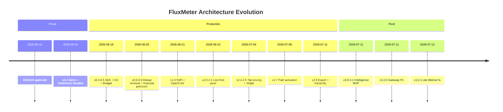

# FluxMeter Architecture Decision Records (ADR)

**Also available in:** [中文 (ADR.md)](ADR.md)

**Version anchor:** Engine 3.2.1 · Python SDK 1.5.0  
**Coverage:** 2026-06-16 (DESIGN approved) → 2026-07-12  
**Evidence priority:** git commit log > changLog.md > progress.md > DESIGN.md  
**Author lens:** Billing SaaS architect — documents *why we chose*, not a feature checklist

---

## Executive Summary: Project Evolution Narrative

In 26 days, FluxMeter evolved from a **Weekend Rocket** (1M eps Flink demo) to a **dual-pillar AI Monetization Platform** (Layer 3 metering + Layer 4 intelligence). This path was not linear planning — it was three rounds of convergence:

1. **Prove (v0.1–0.2)** — Use Flink vs ClickHouse numbers to prove streaming-first works for AI token metering.
2. **Productize (v0.3–2.8)** — Ship financial correctness (Lua atomic deduction, EO, reserve/reconcile), then **Lite-First** to lower integration friction, then **Complement** Metronome/Stripe instead of building an Invoice SoR.
3. **Pivot (v3.0–3.2)** — Industry research confirmed L4 Intelligence as blue ocean; metering stays maintained; narrative shifts to *"OpenMeter tells you what happened; FluxMeter tells you what to do next."*

The git log is more honest than any design doc: five `feat:` commits on 2026-06-22 completed the Lite pivot; three releases on 2026-07-11 shipped the Intelligence + Gateway bundle. Priorities live in commits, not slides.

---

## Decision Index

| ID | Title | Status | Version |
|----|-------|--------|---------|
| [ADR-001](#adr-001-streaming-first-reject-store-then-query) | Streaming-first, reject store-then-query | Accepted | 0.1.0 |
| [ADR-002](#adr-002-java-engine--python-interface-hybrid-stack) | Java engine + Python interface (hybrid stack) | Accepted | 0.1.0 |
| [ADR-003](#adr-003-window-aggregate-then-write-redis) | Window aggregate, then write Redis | Accepted | 0.1.0 |
| [ADR-004](#adr-004-clickhouse-as-honest-baseline) | ClickHouse as honest baseline | Accepted | 0.2.0 |
| [ADR-005](#adr-005-multi-provider-event-schema-up-front) | Multi-provider event schema up front | Accepted | 0.3.0 |
| [ADR-006](#adr-006-incremental-aggregatefunction) | Incremental AggregateFunction | Accepted | 0.4.0 |
| [ADR-007](#adr-007-two-layer-enforcement) | Two-layer enforcement | Accepted | 0.6.0 |
| [ADR-008](#adr-008-three-tier-resilient-budget-check) | Three-tier resilient budget check | Accepted | 0.9.1 |
| [ADR-009](#adr-009-financial-precision-microdollars--sha-256) | Financial precision: microdollars + SHA-256 | Accepted | 1.0.0-rc1 |
| [ADR-010](#adr-010-exactly-once-composition-and-dedup-removal) | Exactly-once composition and dedup removal | Accepted | 0.6.2 / 2.7.1 |
| [ADR-011](#adr-011-reservereconcile-single-path-deduction) | Reserve/reconcile single-path deduction | Accepted | 1.2.0 |
| [ADR-012](#adr-012-apache-20--opencore-layout) | Apache 2.0 + OpenCore layout | Accepted | 1.1.0 |
| [ADR-013](#adr-013-lite-first-dual-path) | Lite-First dual path | Accepted | 2.0.2 |
| [ADR-014](#adr-014-lite-atomic-lua-aggregator) | Lite atomic Lua aggregator | Accepted | 2.1.0 |
| [ADR-015](#adr-015-external-pricing-catalog) | External pricing catalog | Accepted | 1.3.0 / 2.4.0 |
| [ADR-016](#adr-016-complement-dont-replace) | Complement, don't replace | Accepted | 2.8.0 |
| [ADR-017](#adr-017-path-activation) | Path activation | Accepted | 2.7.0 / 3.2.0 |
| [ADR-018](#adr-018-hierarchical-budgets) | Hierarchical budgets | Accepted | 2.8.0 |
| [ADR-019](#adr-019-intelligence-pivot-layer-4) | Intelligence pivot (Layer 4) | Accepted | 3.0.0 |
| [ADR-020](#adr-020-intelligence-reads-redis-rollups) | Intelligence reads Redis rollups | Accepted | 3.0.0 |
| [ADR-021](#adr-021-gateway-as-side-track) | Gateway as side track | Accepted | 3.2.0 |
| [ADR-022](#adr-022-major-version--narrative-shift) | Major version = narrative shift | Accepted | 3.0.0 |
| [ADR-023](#adr-023-phase-7-demand-gated) | Phase 7+ demand-gated | Accepted | 3.1.0 |

---

## ADR Body

### ADR-001: Streaming-first, reject store-then-query

| Field | Content |
|-------|---------|
| **Status** | Accepted |
| **Date / Version** | 2026-06-16 / v0.1.0 |
| **Context** | AI token billing needs real-time aggregation, exactly-once semantics, and backpressure. Mainstream tools (OpenMeter, Orb, Metronome) use store-then-query (persist events → batch aggregate → query). DESIGN.md evaluated three paths: A Weekend Rocket (perf demo), B Domain-first (billing semantics), C Budget Enforcer (kill signal). |
| **Decision** | Choose **Approach A**: Apache Flink 1.18 DataStream API (Java 17) as the metering core. Kafka ingest → keyed tumbling window → Redis sink. ClickHouse baseline for comparison only, not production path. |
| **Consequences** | ✅ 500K eps sustained, 1M eps burst proven; p99 aggregation latency sub-second (10s window). ❌ Higher ops complexity than Redis/API-only; requires Flink + Kafka skills. |
| **Evidence** | DESIGN.md Approach A; commit `81968fd` init; changLog 0.2.0: ClickHouse 8–43s lag vs Flink sub-second. |

**Architect's take:** AI token metering is **continuous aggregation + exactly-once**, not an OLAP query problem. Store-then-query is always one beat late in agent-loop scenarios.

---

### ADR-002: Java engine + Python interface (hybrid stack)

| Field | Content |
|-------|---------|
| **Status** | Accepted |
| **Date / Version** | 2026-06-16 / v0.1.0 |
| **Context** | Split audience: billing engineers want throughput and EO semantics; AI developers want three-line `pip install` integration. PyFlink unifies language but adds serialization overhead. |
| **Decision** | **Java 17 Flink for engine, Python for SDK + FastAPI API layer**. Explicitly reject PyFlink rewrite (ROADMAP non-goals). Engine and SDK use **independent semver** (engine 3.x / SDK 1.5.x). |
| **Consequences** | ✅ 1M+ eps without PyFlink overhead; AI community adopts via Python. ❌ Dual-language maintenance; pricing logic duplicated in Java + Python (later unified via `config/pricing.json`). |
| **Evidence** | DESIGN.md "Architecture: Java Core + Python SDK"; commit `81968fd`. |

---

### ADR-003: Window aggregate, then write Redis

| Field | Content |
|-------|---------|
| **Status** | Accepted |
| **Date / Version** | 2026-06-16 / v0.1.0 |
| **Context** | At 1M eps, per-event Redis writes overwhelm a single instance. Dimensionality must be reduced in the stream layer. |
| **Decision** | Key by `(customer_id, model_id)` → tumbling window (initially 60s, later **10s** for memory) → **post-aggregate** pipeline writes to Redis. 10K customers × 9 models × 10s window ≈ **167 writes/sec**. |
| **Consequences** | ✅ Redis becomes query layer, not event log; Grafana can poll directly. ❌ Query granularity bounded by window (later patched by pre-request check). |
| **Evidence** | DESIGN.md Next Steps #5; changLog 0.2.0 window 60s→10s; [`RedisSink.java`](../src/main/java/io/fluxmeter/sink/RedisSink.java). |

---

### ADR-004: ClickHouse as honest baseline

| Field | Content |
|-------|---------|
| **Status** | Accepted |
| **Date / Version** | 2026-06-19 / v0.2.0 |
| **Context** | DESIGN Open Question #1: ClickHouse vs Postgres baseline? Postgres gap is more dramatic but less fair. |
| **Decision** | Keep `baseline/` directory: ClickHouse Kafka engine + materialized views + SummingMergeTree, 5s poll queries. **Benchmark comparison only — not a product storage path.** |
| **Consequences** | ✅ Reproducible HN/README numbers; honest comparison builds credibility. ❌ Baseline maintenance cost; not on production path. |
| **Evidence** | changLog 0.2.0; `make benchmark`; DESIGN Open Questions resolved. |

---

### ADR-005: Multi-provider event schema up front

| Field | Content |
|-------|---------|
| **Status** | Accepted |
| **Date / Version** | 2026-06-19 / v0.3.0 |
| **Context** | Initial schema used `tokenType` enum + single `tokenCount` — cannot express OpenAI cache tokens, Anthropic reasoning tokens, and 2026 multi-category pricing. |
| **Decision** | **Breaking change early**: separate fields for `inputTokens`, `outputTokens`, `cacheReadTokens`, `cacheWriteTokens`, `reasoningTokens`, `embeddingTokens`; add `provider`, `spanId`, `sessionId` tracing fields. Rename TokenFlink → **FluxMeter**. |
| **Consequences** | ✅ Stable contract for exporters, interop spec, Intelligence dims. ❌ Pre-0.3.0 integrators must migrate (no external users yet — acceptable cost). |
| **Evidence** | changLog 0.3.0 BREAKING; Weekend 2 checklist in progress.md. |

---

### ADR-006: Incremental AggregateFunction

| Field | Content |
|-------|---------|
| **Status** | Accepted |
| **Date / Version** | 2026-06-19 / v0.4.0 |
| **Context** | Initial `ProcessWindowFunction` buffered all raw events per window. 500K eps × 10s window = 5M events/key peak → **OOM**. |
| **Decision** | Switch to **`AggregateFunction`**: maintain a single `UsageAggregate` accumulator per window. Memory **O(keys)** not O(events). |
| **Consequences** | ✅ Stable at 5K eps on 4GB TMs; 1M eps burst for 30–40s. ❌ Cannot do full event-list operations in-window (late data handled via side output DLQ). |
| **Evidence** | changLog 0.4.0; [`UsageAggregateFunction.java`](../src/main/java/io/fluxmeter/job/UsageAggregateFunction.java). |

---

### ADR-007: Two-layer enforcement

| Field | Content |
|-------|---------|
| **Status** | Accepted |
| **Date / Version** | 2026-06-19 / v0.6.0 |
| **Context** | Flink deducts budget only after window close (10–15s delay). Agent loops can burn budget in 15 seconds with no system awareness. Industry consensus: pre-call > post-call (see industry-billing-research-2026.md). |
| **Decision** | **Two-layer model:** • **Layer 1 — Pre-request check**: `GET /budget/{id}/check`, <10ms, hard gate before provider call. • **Layer 2 — Post-window deduction**: Flink aggregate → atomic Lua deduction → Kafka kill signal. |
| **Consequences** | ✅ Closes 10–15s enforcement gap; SHOW_HN title shifts from 1M eps to <10ms check (v2.2.1). ❌ Integrators must call check on hot path (later enforced via wrap/proxy — ADR-017). |
| **Evidence** | changLog 0.6.0; README two-layer table; progress Success Criteria #11. |

---

### ADR-008: Three-tier resilient budget check

| Field | Content |
|-------|---------|
| **Status** | Accepted |
| **Date / Version** | 2026-06-20 / v0.9.1 |
| **Context** | Pre-request check hard-dependent on Redis blocks agent hot path on Redis failure — unacceptable for agent platforms. |
| **Decision** | Three-tier resilience stack: 1. **In-process cache** (0.01ms, 30s TTL) 2. **Redis GET** (1–5ms, authoritative, updates cache on success) 3. **Fail policy** (`BUDGET_FAIL_POLICY=open\|closed` when Redis unavailable) Response includes `"source": "redis\|cache\|policy"` for observability. Gateway reuses same logic ([`budget_gate.py`](../api/budget_gate.py)). |
| **Consequences** | ✅ Agent workloads don't stall on infra failure. ❌ Cache may be slightly stale for 30s (acceptable — post-window remains authoritative settlement). |
| **Evidence** | changLog 0.9.1; [`budget_gate.py`](../api/budget_gate.py) module docstring. |

---

### ADR-009: Financial precision: microdollars + SHA-256

| Field | Content |
|-------|---------|
| **Status** | Accepted |
| **Date / Version** | 2026-06-20 / 1.0.0-rc1 |
| **Context** | Production audit found 10 financial/durability issues: float drift, hashCode collision (1/77K), wrong Lua threshold semantics, WAL partial ack data loss, etc. |
| **Decision** | • Internal **`costMicro` (long)**, external `getCostUsd()` conversion — zero precision drift. • Idempotency key uses **SHA-256 64-bit prefix**, collision probability 1/4B. • Lua threshold based on `initial_balance_usd`, not current balance. • WAL per-event ack + drain on exit. |
| **Consequences** | ✅ 1.0.0-rc1 declares "suitable for production billing workloads." ❌ Migration cost (internal long, API still float USD). |
| **Evidence** | changLog 1.0.0-rc1 (10 issues); commit `e9642a5` rc3 WAL fix. |

---

### ADR-010: Exactly-once composition and dedup removal

| Field | Content |
|-------|---------|
| **Status** | Accepted (includes decision reversal) |
| **Date / Version** | 2026-06-20 / 0.6.2; hardened 2.7.1 |
| **Context** | Week 4 architecture review found three CRITICAL/HIGH issues: 1. Flink `EventDeduplicator` keyed by eventId → 1 key/event → at 500K eps **1.8B keys/hour → guaranteed OOM**. 2. `allowedLateness(30s)` + Sink SET NX → late data re-triggers window but NX blocks write → **silent data loss**. 3. Counter increment and budget deduction non-atomic → customers get free tokens in crash window. |
| **Decision** | **Delete > add:** • **Remove** Flink EventDeduplicator — sink-level SET NX is sufficient. • **Remove** allowedLateness — late events exclusively → sideOutput → Kafka DLQ. • Merge counter + budget + idempotency into **single Lua EVAL** (2.7.1 further eliminates pipeline crash window). • Checkpoint: EXACTLY_ONCE + 10m timeout + `tolerableCheckpointFailureNumber(3)`. |
| **Consequences** | ✅ No OOM at production throughput; late data not silently dropped; financial atomicity. ❌ DLQ requires ops replay (`scripts/dlq_replay.py`); late data excluded from main window (by design). |
| **Evidence** | changLog 0.6.2 CRITICAL fixes; changLog 2.7.1; [`LateDataSideOutputTest.java`](../src/test/java/io/fluxmeter/job/LateDataSideOutputTest.java). |

**One of the most important reversals in this project:** the initial "add dedup operator for EO" was more dangerous at production scale than having no dedup at all.

---

### ADR-011: Reserve/reconcile single-path deduction

| Field | Content |
|-------|---------|
| **Status** | Accepted |
| **Date / Version** | 2026-06-20 / 0.8.0; hardened 1.2.0 |
| **Context** | Streaming LLM responses can last 30–120s. Waiting for window close allows concurrent requests to overdraw the same wallet. Industry Hold step: SpendGuard reserve/commit, Stripe auth/capture. |
| **Decision** | • `POST /budget/{id}/reserve` — pessimistic hold (`held_usd`), does not deduct balance directly. • `POST /budget/{id}/reconcile` — release hold, settle difference. • **Flink Sink is sole `balance_usd` mutator** (1.2.0 fixes streaming double-charge). • `check` uses `effective_balance = balance - held`. |
| **Consequences** | ✅ Budget safety in streaming scenarios; SDK `wrap_stream` + Gateway stream kill have semantic foundation. ❌ Integration complexity (three APIs: check / reserve / reconcile). |
| **Evidence** | changLog 0.8.0, 1.2.0; industry-billing-research §3 Hold step. |

---

### ADR-012: Apache 2.0 + OpenCore layout

| Field | Content |
|-------|---------|
| **Status** | Accepted |
| **Date / Version** | 2026-06-21 / 1.1.0 |
| **Context** | DESIGN Open Question #4: Apache 2.0 vs AGPL? Cloud host-without-contribute risk vs maximum adoption. |
| **Decision** | • **Apache 2.0** license. • **OpenCore repo layout**: `spec/` (schema + OpenAPI) + `sdk/` (Python + JS) + `contrib/` (provider mappings) + `src/` (Java reference engine). • **Commercial model**: all features open source; revenue from Hosted SaaS + onboarding + enterprise support (demand-gated). |
| **Consequences** | ✅ Maximum adoption; spec is product surface, engine is reference implementation. ❌ Cloud vendors can fork without contributing (accepted trade-off). |
| **Evidence** | changLog 1.1.0; DESIGN Open Questions resolved; Intelligence pivot spec monetization table. |

---

### ADR-013: Lite-First dual path

| Field | Content |
|-------|---------|
| **Status** | Accepted (strategic reversal) |
| **Date / Version** | 2026-06-22 / 2.0.2 |
| **Context** | v0.x–v1.x default `make demo` started Kafka + Flink + Redis — too heavy for side projects / <100K eps integrators. 1M eps is a credibility asset, not default DX. |
| **Decision** | **Five commits in one day (2026-06-22) completed the pivot:** • `docker-compose.yml` = **Lite** (API → Redis Lua, no Kafka/Flink) • `docker-compose.full.yml` = Full stack • `make demo` = Lite; `make demo-full` = Full • Same Redis key schema + OpenAPI contract • Later layers: Lua aggregator (2.1.0) → rollup worker → Stripe export → SaaS control plane |
| **Consequences** | ✅ `docker-compose up` runnable in ~30s; 90% of integrators zero Flink ops. ❌ Dual-path correctness regression burden (`make test-lite` + `make test-java`); Lite/Full semantics must stay aligned. |
| **Evidence** | commits `66a1c70`, `abd76ae`, `75a3bf6`, `ac3f956`, `682ae1a`; [dual-path-lite-saas plan](superpowers/plans/2026-06-22-dual-path-lite-saas.md). |

**Architect's take:** Demo throughput ≠ default DX. First disprove "you need Flink to meter," then let 1M eps users take the Full path.

---

### ADR-014: Lite atomic Lua aggregator

| Field | Content |
|-------|---------|
| **Status** | Accepted |
| **Date / Version** | 2026-06-22 / 2.1.0; fix 3.2.1 |
| **Context** | Initial `lite_aggregate.py` used Redis pipeline — idempotency, counters, budget deduction non-atomic; crash window could double-count or miss deductions. Rollup worker must compact live counters without destroying lifetime totals. |
| **Decision** | • **`lite_aggregate_lua.py`**: single Lua EVAL for idempotency + counters + inline budget + global counters. • **`rollup_worker.py`**: asyncio 60s cycle, compact to `buf:*` / period / day buckets. • **3.2.1 lesson**: separate lifetime counters (`customer:{id}:*`) from buffer counters (`customer:{id}:buf:*`) — rollup archives buf only, never resets lifetime. |
| **Consequences** | ✅ Lite path financial semantics align with Full Flink sink. ❌ Lua script debugging cost; rollup bugs can lose lifetime data (3.2.1 fixed; legacy data not recoverable). |
| **Evidence** | changLog 2.1.0, 3.2.1; commit `0be0827`; [`rollup_worker.py`](../api/rollup_worker.py) ponytail comment. |

---

### ADR-015: External pricing catalog

| Field | Content |
|-------|---------|
| **Status** | Accepted |
| **Date / Version** | 2026-06-21 / 1.3.0; tiered 2.4.0 |
| **Context** | Initial `UsageAggregate.calculateCost()` hardcoded flat rates — cannot handle 9+ models, cache/reasoning price deltas, volume/graduated tiers. |
| **Decision** | • **`config/pricing.json`** external catalog; dual implementation in Java `PricingCatalog` + Python `pricing_loader.py`. • Support `flat` / `volume` / `graduated` + `volume_scope` / `billing_period` (2.4.0). • **Re-rate**: differential adjustment (preview + apply), **not event replay** (0.8.0) — ops-friendly. • Admin API: `GET /pricing`, `PUT /admin/pricing`, `POST /admin/pricing/validate`. |
| **Consequences** | ✅ 20+ models (including China domestic 2.6.0) without code changes; contrib community can PR pricing snapshots. ❌ Java/Python must stay in sync; tier re-rate returns 422 for non-flat (known limit). |
| **Evidence** | changLog 1.3.0, 2.4.0, 2.6.0; [`PricingCatalog.java`](../src/main/java/io/fluxmeter/pricing/PricingCatalog.java). |

---

### ADR-016: Complement, don't replace

| Field | Content |
|-------|---------|
| **Status** | Accepted |
| **Date / Version** | 2026-07-04 / 2.5.0; multi-target 2.8.0 |
| **Context** | July 2026 industry research confirmed Metronome/Orb/Stripe/Lago are mature at Invoice SoR (contracts, rating, invoices, payments). Building invoice platform in-house enters red ocean and splits engineering focus. |
| **Decision** | • **Position as Runtime SoR**: meter + check + reserve + kill + export. • **Export, not replace**: Stripe / Metronome / Orb multi-target (`BILLING_EXPORT_TARGETS`); partner recipes in `docs/integrations/`. • **Explicit non-goals**: ASC 606, MoR, multi-year commits, true-ups, replacing Langfuse as trace SoR. |
| **Consequences** | ✅ Coexist with invoice platforms; "FluxMeter + Metronome" recipe is sellable. ❌ Not a standalone billing product; customers need their own invoice SoR or Stripe export. |
| **Evidence** | changLog 2.5.0, 2.8.0; [industry-billing-research-2026.md](industry-billing-research-2026.md); ROADMAP explicit non-goals. |

---

### ADR-017: Path activation

| Field | Content |
|-------|---------|
| **Status** | Accepted |
| **Date / Version** | 2026-07-06 / 2.7.0; Gateway 3.2.0 |
| **Context** | Industry decision waterfall Step 0: **does traffic must pass through a control point?** Pure SDK libraries (call `check`) are easy to skip — developers forget pre-call check → overdraft. LiteLLM/Portkey/reseller gateways enforce on the proxy path. 2026-07-06 ROADMAP reprioritized: path activation before Full SaaS RBAC. |
| **Decision** | Three-piece progression: 1. **`wrap(OpenAI())`** — SDK 1.4.0, fail-open, pre-call check + post-call track + mid-stream kill (2.7.0) 2. **Lite webhooks** — `BUDGET_LOW` / `EXHAUSTED` / `WARN` 70/90 without Kafka (2.7.0) 3. **Gateway proxy** — OpenAI-compatible `:8080`, pre-check + stream reserve + mid-flight kill + proxy-only ingest (3.2.0) |
| **Consequences** | ✅ Integrators cannot "forget check"; TokenBridge/ClipLive customer stories land. ❌ Proxy adds latency hop; stream kill uses char/4 heuristic when provider omits usage (ponytail). |
| **Evidence** | commits `7d8ad82`, `83d23ca`; changLog 2.7.0, 3.2.0; [`stream_guard.py`](../api/gateway/stream_guard.py). |

---

### ADR-018: Hierarchical budgets

| Field | Content |
|-------|---------|
| **Status** | Accepted |
| **Date / Version** | 2026-07-11 / 2.8.0 |
| **Context** | Enterprise scenarios need Org → Team → User → Key / Agent session hierarchical quotas to prevent noisy neighbors. Claude Enterprise inheritance, Cursor spend limits, LiteLLM session caps are all productized. |
| **Decision** | • **`POST /budget/{id}/cap`** + `check?parent_span_id=` / `session_id=` — span/session hard max. • **`POST /budget/{id}/reserve?parent_span_id=`** — atomic hold on customer + span cap pool. • **Per-key API budgets** — `POST /admin/customers/{id}/apikeys/{key_id}/budget`; enforced on `/check`. • **Metadata dims** — ingest `metadata` whitelist → `GET /usage/dim/{key}/{value}` for Intelligence attribution. |
| **Consequences** | ✅ Agent platforms get per-run caps; reseller gateways get key-level budgets. ❌ Hierarchical reserve Lua complexity; Full Flink path span tier still flat (ponytail in TokenUsageAggregator). |
| **Evidence** | changLog 2.8.0; commit `3142d0c`; SDK 1.5.0 `reserve(parent_span_id=)`. |

---

### ADR-019: Intelligence pivot (Layer 4)

| Field | Content |
|-------|---------|
| **Status** | Accepted (product narrative reversal) |
| **Date / Version** | 2026-07-11 / 3.0.0 |
| **Context** | L3 Metering (OpenMeter, Metronome, Lago) is crowded; L4 Intelligence (root cause, unit economics, simulation) is blue ocean. FinOps Foundation 2026: 98% of teams managing AI spend. Metering is credibility, not the only differentiator. |
| **Decision** | • **Dual-pillar platform**: Pillar A Metering **maintained**, not deprecated; Pillar B Intelligence is **primary product narrative**. • Tagline: *"OpenMeter tells you what happened; FluxMeter tells you what to do next."* • Phase 5 MVP (3.0.0): root cause + unit economics + simulation + OpenMeter overlay. • Phase 6 v1.0 (3.1.0): pricing optimizer + profitability + forecast + alerts + report. |
| **Consequences** | ✅ L4 differentiation; same rollups feed Intelligence. ❌ Dual-pillar maintenance burden; README/HN narrative must sync (commit `36eef03` strategic positioning). |
| **Evidence** | commits `36eef03`, `83d23ca`; [intelligence-pivot-design.md](superpowers/specs/2026-07-11-intelligence-pivot-design.md); changLog 3.0.0, 3.1.0. |

---

### ADR-020: Intelligence reads Redis rollups

| Field | Content |
|-------|---------|
| **Status** | Accepted |
| **Date / Version** | 2026-07-11 / 3.0.0 |
| **Context** | Intelligence MVP must ship in 2–3 days. Building separate warehouse (ClickHouse/BigQuery) + ETL blocks MVP. Flink/Java engine already produces high-quality rollups. |
| **Decision** | • **`api/intelligence/`** Python module reads `native_reader` (Redis rollups) + OpenMeter overlay connector. • **Does not replace Flink engine**; Intelligence is read-mostly analytics layer. • MVP uses **ponytail heuristics**: simulation assumes input ~50% of cost; profitability allocates revenue by cost-share; forecast uses linear EOM projection ([`forecast.py`](../api/intelligence/forecast.py) L47–48). • Every ponytail comment documents ceiling + upgrade path (→ Phase 6 optimizer / per-SKU revenue). |
| **Consequences** | ✅ 3.0.0 + 3.1.0 shipped within a week; 29 intelligence tests green. ❌ Heuristic precision limited; no ML forecasting; overlay OpenMeter only (Langfuse backlog). |
| **Evidence** | changLog 3.0.0, 3.1.0; [intelligence-api.md](intelligence-api.md). |

---

### ADR-021: Gateway as side track

| Field | Content |
|-------|---------|
| **Status** | Accepted |
| **Date / Version** | 2026-07-11 / 3.2.0 |
| **Context** | Original ROADMAP Gateway competed with Intelligence MVP for engineering bandwidth. Intelligence pivot spec: Gateway **must not block** 3.0.0 Intelligence tag. |
| **Decision** | • **3.0.0** = Intelligence MVP major. • **3.2.0** = Gateway P1 (proxy + pre-check + stream kill). • Shared [`budget_gate.py`](../api/budget_gate.py) — `/check` and Gateway use same logic, no duplicate implementation. • P2 (LiteLLM hooks, TPM limits, predictive cost) explicitly backlog, not active. |
| **Consequences** | ✅ Intelligence ships first to validate PMF; Gateway reuses budget gate. ❌ Helm gateway deployment deferred to Phase G.1. |
| **Evidence** | changLog 3.2.0; [gateway.md](gateway.md); Intelligence pivot spec Phase G section. |

---

### ADR-022: Major version = narrative shift

| Field | Content |
|-------|---------|
| **Status** | Accepted |
| **Date / Version** | 2026-07-11 / 3.0.0 |
| **Context** | Semver convention: major = breaking API. 3.0.0 is product narrative shift (Layer 3 → Layer 4) with no metering endpoint breaks. |
| **Decision** | **3.0.0 major bump for narrative shift**, not API break. changLog explicitly notes: "Major bump = product narrative shift, not breaking API for existing metering endpoints." |
| **Consequences** | ✅ Version number communicates strategic pivot; existing integrators no forced migration. ❌ Semver purists may be confused — docs must be explicit. |
| **Evidence** | changLog 3.0.0 Notes. |

---

### ADR-023: Phase 7+ demand-gated

| Field | Content |
|-------|---------|
| **Status** | Accepted |
| **Date / Version** | 2026-07-11 / 3.1.0 |
| **Context** | SaaS control plane scaffold shipped (2.2.0 `:8001` tenant CRUD), but Full RBAC / SSO / NL agent / Hosted SaaS need engineering investment without validated demand. |
| **Decision** | • **Intelligence complete at 3.1.0** — no separate 4.0.0 Intelligence track. • **Phase 7+ demand-gated**: Hosted SaaS, NL agent, enterprise RBAC, A/B pricing experiments — **start only with traction**. • **Ongoing metering maintenance** is not optional — every release must keep `make test-java` + `make test-lite` green. |
| **Consequences** | ✅ Avoids premature SaaS build; open-source → paid conversion path is clear. ❌ npm registry push still pending auth; Hosted SaaS not launched. |
| **Evidence** | ROADMAP Phase 7+ table; progress.md Phase 7+ Planned; Intelligence pivot spec monetization. |

---

## Evolution Timeline

### Key Commit Cross-Reference

| Date | Commit | Decision significance |
|------|--------|----------------------|
| 2026-06-21 | `81968fd` init | ADR-001/002/003 origin |
| 2026-06-20 | changLog 0.6.2 | ADR-010 dedup removal |
| 2026-06-22 | `66a1c70`–`682ae1a` | ADR-013 Lite-First five commits in one day |
| 2026-07-06 | `7d8ad82` | ADR-017 wrap/webhook |
| 2026-07-11 | `36eef03` | ADR-019 strategic positioning doc |
| 2026-07-11 | `83d23ca` | ADR-019/021 Intelligence + Gateway bundle |
| 2026-07-12 | `0be0827` | ADR-014 rollup lifetime fix |

---

## Decision Pattern Retrospective

Reusable principles distilled from 23 ADRs — applicable to billing SaaS and streaming infra products:

### 1. Prove → Productize → Pivot

Don't skip Prove. The 1M eps number is the credibility foundation for Lite-First and Intelligence Pivot. Without Week 4e load tests, Lite path would be dismissed as "downgraded."

### 2. Delete to scale

ADR-010 is the exemplar: **removing** EventDeduplicator and allowedLateness mattered more than **adding** OptimizedRedisSink. An architect's value is often knowing what should not exist.

### 3. Financial ops are non-negotiable

Lua atomicity, microdollars, reconciliation job, SET NX idempotency — treat every code review as a production incident rehearsal. The 1.0.0-rc1 ten-issue audit and Bugbot 15 findings are ship gates, not blockers.

### 4. Complement strategy

Coexist with Metronome/Stripe/Orb: compete for Runtime SoR + Decision Layer, not Invoice SoR. Export recipes are GTM assets, not architectural compromises.

### 5. Ponytail engineering ethics

MVPs may use heuristics (linear forecast extrapolation, simulation input=50% cost), but **`ponytail:` comments must document ceiling + upgrade path**. Lazy ≠ careless. See [`.cursor/rules/ponytail-mdc.mdc`](../.cursor/rules/ponytail-mdc.mdc).

### 6. Git log is more truthful than DESIGN

Five commits completed Lite pivot on 2026-06-22; three releases shipped Intelligence bundle on 2026-07-11 — priorities live in commits, not roadmap slides. Always cross-reference git log when reading ADRs.

### 7. Dual-path is a product decision, not a technical shortcut

Lite and Full share Redis schema + OpenAPI — Lite is not a "crippled version" but **two deployment profiles of the same product**. Correctness regression is an ongoing tax, not a one-time cost.

---

## Explicit Non-Goals and Open Questions

### Explicit Non-Goals (from ROADMAP + ADR consensus)

| Non-goal | Rationale |
|----------|-----------|
| Replace Langfuse/Helicone as trace SoR | L2 crowded; overlay ingest sufficient |
| Replace Metronome/Orb/Stripe as Invoice SoR | L3 red ocean; export coexistence |
| ASC 606 / MoR / multi-year commits | Enterprise billing complexity; demand-gated |
| PyFlink rewrite | Rejected in ADR-002 |
| Freeze or deprecate metering engine | Dual-pillar model; Pillar A maintained |
| Guaranteed 1M eps on laptop docker-compose | Redis Lua sink local bottleneck ~100K sustained |
| Further Intelligence polish beyond 3.1.0 MVP | Langfuse connector, extra dashboards — unless demand |

### Open Questions

| Question | Status |
|----------|--------|
| GitHub org vs personal account | Unresolved |
| npm `@fluxmeter/client` registry push | Pack-ready 1.3.0; needs NPM_TOKEN |
| Hosted SaaS launch timing | Demand-gated Phase 7+ |
| Langfuse/Helicone overlay connectors | Backlog |

---

## References

| Document | Purpose |
|----------|---------|
| [docs/DESIGN.md](DESIGN.md) | Original architecture intent (2026-06-16 approved) |
| [changLog.md](../changLog.md) | Versioned release evidence |
| [progress.md](../progress.md) | Milestone checklist status |
| [ROADMAP.md](../ROADMAP.md) | Forward plan + non-goals |
| [docs/industry-billing-research-2026.md](industry-billing-research-2026.md) | Industry calibration + path activation basis |
| [docs/strategic-positioning-2026.md](strategic-positioning-2026.md) | L1–L4 market map |
| [docs/superpowers/specs/2026-07-11-intelligence-pivot-design.md](superpowers/specs/2026-07-11-intelligence-pivot-design.md) | Intelligence pivot locked decisions |
| [docs/superpowers/plans/2026-06-22-dual-path-lite-saas.md](superpowers/plans/2026-06-22-dual-path-lite-saas.md) | Lite-First implementation plan |
| [docs/intelligence-api.md](intelligence-api.md) | Pillar B API reference |
| [docs/gateway.md](gateway.md) | Phase G Gateway reference |

---

*This document is updated with major architecture decisions. New ADRs append to "ADR Body" and update the index table. Last updated: 2026-07-12.*
