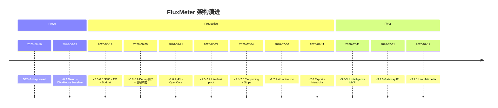

# FluxMeter 架构决策记录（ADR）

**English version:** [ADR-en.md](ADR-en.md)

**版本锚点：** Engine 3.2.1 · Python SDK 1.5.0  
**覆盖区间：** 2026-06-16（DESIGN 批准）→ 2026-07-12  
**证据优先级：** git commit log > changLog.md > progress.md > DESIGN.md  
**作者视角：** 计费 SaaS 架构师 — 记录「为什么这样选」，而非「做了什么功能清单」

---

## 摘要：项目演进叙事

FluxMeter 在 26 天内从 **Weekend Rocket**（1M eps Flink Demo）演进为 **双柱 AI Monetization Platform**（Layer 3 计量 + Layer 4 智能）。这条路径不是线性规划的结果，而是三轮收敛：

1. **Prove（v0.1–0.2）** — 用 Flink vs ClickHouse 数字证明「流式优先」在 AI token 计量上成立。
2. **Productize（v0.3–2.8）** — 补齐金融正确性（Lua 原子扣费、EO、reserve/reconcile），再 **Lite-First** 降集成门槛，最后 **Complement** Metronome/Stripe 而非自建 Invoice SoR。
3. **Pivot（v3.0–3.2）** — 行业调研确认 L4 Intelligence 蓝海；Metering 保留维护，叙事主战场转向「OpenMeter tells you what happened; FluxMeter tells you what to do next」。

Git log 比任何设计文档都更诚实：2026-06-22 一天 5 个 `feat:` commit 完成 Lite pivot；2026-07-11 单日三连发完成 Intelligence + Gateway bundle。优先级写在 commit 里，不在 slide 里。

---

## 决策索引

| ID | 标题 | Status | 版本 |
|----|------|--------|------|
| [ADR-001](#adr-001-流式优先拒绝-store-then-query) | 流式优先，拒绝 Store-then-Query | Accepted | 0.1.0 |
| [ADR-002](#adr-002-java-引擎--python-界面混合栈) | Java 引擎 + Python 界面（混合栈） | Accepted | 0.1.0 |
| [ADR-003](#adr-003-窗口聚合后再写-redis) | 窗口聚合后再写 Redis | Accepted | 0.1.0 |
| [ADR-004](#adr-004-clickhouse-作为诚实对照组) | ClickHouse 作为诚实对照组 | Accepted | 0.2.0 |
| [ADR-005](#adr-005-多-provider-事件-schema-一次到位) | 多 Provider 事件 Schema 一次到位 | Accepted | 0.3.0 |
| [ADR-006](#adr-006-incremental-aggregatefunction) | Incremental AggregateFunction | Accepted | 0.4.0 |
| [ADR-007](#adr-007-双层-enforcement) | 双层 Enforcement | Accepted | 0.6.0 |
| [ADR-008](#adr-008-三层弹性-budget-check) | 三层弹性 Budget Check | Accepted | 0.9.1 |
| [ADR-009](#adr-009-金融精度-microdollars--sha-256-幂等) | 金融精度：microdollars + SHA-256 | Accepted | 1.0.0-rc1 |
| [ADR-010](#adr-010-exactly-once-组合与-dedup-删除) | Exactly-Once 组合与 Dedup 删除 | Accepted | 0.6.2 / 2.7.1 |
| [ADR-011](#adr-011-reservereconcile-单路径扣费) | Reserve/Reconcile 单路径扣费 | Accepted | 1.2.0 |
| [ADR-012](#adr-012-apache-20--opencore-分层) | Apache 2.0 + OpenCore 分层 | Accepted | 1.1.0 |
| [ADR-013](#adr-013-lite-first-双路径) | Lite-First 双路径 | Accepted | 2.0.2 |
| [ADR-014](#adr-014-lite-原子-lua-聚合器) | Lite 原子 Lua 聚合器 | Accepted | 2.1.0 |
| [ADR-015](#adr-015-外部-pricing-catalog) | 外部 Pricing Catalog | Accepted | 1.3.0 / 2.4.0 |
| [ADR-016](#adr-016-complement-dont-replace) | Complement, Don't Replace | Accepted | 2.8.0 |
| [ADR-017](#adr-017-path-activation) | Path Activation | Accepted | 2.7.0 / 3.2.0 |
| [ADR-018](#adr-018-层级预算) | 层级预算 | Accepted | 2.8.0 |
| [ADR-019](#adr-019-intelligence-pivot-layer-4) | Intelligence Pivot（Layer 4） | Accepted | 3.0.0 |
| [ADR-020](#adr-020-intelligence-读-redis-rollups) | Intelligence 读 Redis Rollups | Accepted | 3.0.0 |
| [ADR-021](#adr-021-gateway-作为-side-track) | Gateway 作为 Side Track | Accepted | 3.2.0 |
| [ADR-022](#adr-022-major-version--叙事变更) | Major Version = 叙事变更 | Accepted | 3.0.0 |
| [ADR-023](#adr-023-phase-7-demand-gated) | Phase 7+ Demand-Gated | Accepted | 3.1.0 |

---

## ADR 正文

### ADR-001: 流式优先，拒绝 Store-then-Query

| 字段 | 内容 |
|------|------|
| **Status** | Accepted |
| **Date / Version** | 2026-06-16 / v0.1.0 |
| **Context** | AI token 计费需要实时聚合、exactly-once、背压处理。OpenMeter/Orb/Metronome 等主流方案走 store-then-query（事件入库 → 定时聚合 → 查询）。DESIGN.md 评估了三种路径：A Weekend Rocket（性能 Demo）、B Domain-first（计费语义）、C Budget Enforcer（kill signal）。 |
| **Decision** | 选 **Approach A**：Apache Flink 1.18 DataStream API（Java 17）作为计量核心。Kafka 摄入 → keyed tumbling window → Redis sink。ClickHouse baseline 仅作对照，不做主路径。 |
| **Consequences** | ✅ 500K eps 可持续、1M eps burst 可证；p99 聚合延迟 sub-second（10s 窗口）。❌ 运维复杂度高于纯 Redis/API；需要 Flink + Kafka 技能栈。 |
| **Evidence** | DESIGN.md Approach A；commit `81968fd` init；changLog 0.2.0：ClickHouse 8–43s lag vs Flink sub-second。 |

**架构师判断：** AI token 计量本质是 **continuous aggregation + exactly-once**，不是 OLAP 查询问题。Store-then-query 在 agent 循环场景下永远慢半拍。

---

### ADR-002: Java 引擎 + Python 界面（混合栈）

| 字段 | 内容 |
|------|------|
| **Status** | Accepted |
| **Date / Version** | 2026-06-16 / v0.1.0 |
| **Context** | 目标受众分裂：billing 工程师要吞吐和 EO 语义；AI 开发者要 `pip install` 三行集成。PyFlink 可统一语言，但有 serialization overhead。 |
| **Decision** | **Java 17 Flink 做引擎，Python 做 SDK + FastAPI API 层**。明确拒绝 PyFlink rewrite（ROADMAP non-goals）。Engine 与 SDK **独立 semver**（engine 3.x / SDK 1.5.x）。 |
| **Consequences** | ✅ 1M+ eps 无 PyFlink 开销；AI 社区通过 Python 接入。❌ 双语言维护；pricing 逻辑需在 Java + Python 双实现（后由 `config/pricing.json` 统一）。 |
| **Evidence** | DESIGN.md「Architecture: Java Core + Python SDK」；commit `81968fd`。 |

---

### ADR-003: 窗口聚合后再写 Redis

| 字段 | 内容 |
|------|------|
| **Status** | Accepted |
| **Date / Version** | 2026-06-16 / v0.1.0 |
| **Context** | 原始事件 1M eps 若 per-event 写 Redis，单实例 Redis 无法承受。需在流处理层降维。 |
| **Decision** | Keyed by `(customer_id, model_id)` → tumbling window（初版 60s，后改 **10s** 降内存）→ **聚合后** pipeline 写 Redis。10K customers × 9 models × 10s window ≈ **167 writes/sec**。 |
| **Consequences** | ✅ Redis 成为查询层而非事件日志；Grafana 可直接 poll。❌ 查询粒度受窗口限制（后由 pre-request check 补实时性）。 |
| **Evidence** | DESIGN.md Next Steps #5；changLog 0.2.0 窗口 60s→10s；[`RedisSink.java`](../src/main/java/io/fluxmeter/sink/RedisSink.java)。 |

---

### ADR-004: ClickHouse 作为诚实对照组

| 字段 | 内容 |
|------|------|
| **Status** | Accepted |
| **Date / Version** | 2026-06-19 / v0.2.0 |
| **Context** | DESIGN Open Question #1：ClickHouse vs Postgres baseline？Postgres 差距更dramatic但不公平。 |
| **Decision** | 保留 `baseline/` 目录：ClickHouse Kafka engine + materialized views + SummingMergeTree，5s poll 查询。**仅用于 benchmark 对照，不做产品存储路径**。 |
| **Consequences** | ✅ HN/README 有可复现数字；✅ 诚实对比建立 credibility。❌ baseline 维护成本；不参与生产路径。 |
| **Evidence** | changLog 0.2.0；`make benchmark`；DESIGN Open Questions resolved。 |

---

### ADR-005: 多 Provider 事件 Schema 一次到位

| 字段 | 内容 |
|------|------|
| **Status** | Accepted |
| **Date / Version** | 2026-06-19 / v0.3.0 |
| **Context** | 初版 schema 用 `tokenType` enum + 单一 `tokenCount`，无法表达 OpenAI cache tokens、Anthropic reasoning tokens 等 2026 年多 category 定价。 |
| **Decision** | **Breaking change 在早期完成**：`inputTokens` / `outputTokens` / `cacheReadTokens` / `cacheWriteTokens` / `reasoningTokens` / `embeddingTokens` 分字段；加 `provider`、`spanId`、`sessionId` 等 tracing 字段。项目更名 TokenFlink → **FluxMeter**。 |
| **Consequences** | ✅ 后续 exporter、interop spec、Intelligence dims 有稳定契约。❌ 0.3.0 前集成者需迁移（当时无外部用户，成本可控）。 |
| **Evidence** | changLog 0.3.0 BREAKING；Weekend 2 checklist progress.md。 |

---

### ADR-006: Incremental AggregateFunction

| 字段 | 内容 |
|------|------|
| **Status** | Accepted |
| **Date / Version** | 2026-06-19 / v0.4.0 |
| **Context** | 初版 `ProcessWindowFunction` 在窗口内攒全量 raw events。500K eps × 10s window = 500 万 events/key 峰值 → **OOM**。 |
| **Decision** | 改用 **`AggregateFunction`**：窗口内只维护单个 `UsageAggregate` 累加器。内存 **O(keys)** 而非 O(events)。 |
| **Consequences** | ✅ 5K eps 在 4GB TM 上稳定；✅ 1M eps burst 可跑 30–40s。❌ 窗口内无法做需要全量 event list 的操作（后由 side output DLQ 补 late data）。 |
| **Evidence** | changLog 0.4.0；[`UsageAggregateFunction.java`](../src/main/java/io/fluxmeter/job/UsageAggregateFunction.java)。 |

---

### ADR-007: 双层 Enforcement

| 字段 | 内容 |
|------|------|
| **Status** | Accepted |
| **Date / Version** | 2026-06-19 / v0.6.0 |
| **Context** | Flink 窗口关窗后才扣费（10–15s 延迟）。Agent 循环可在 15 秒内烧光预算而系统无感知。行业共识：Pre-call > post-call（见 industry-billing-research-2026.md）。 |
| **Decision** | **双层模型**： • **Layer 1 — Pre-request check**：`GET /budget/{id}/check`，<10ms，请求 provider 前硬闸。 • **Layer 2 — Post-window deduction**：Flink 聚合 → 原子 Lua 扣费 → Kafka kill signal。 |
| **Consequences** | ✅ 关闭 10–15s enforcement gap；✅ SHOW_HN 标题从 1M eps 转向 <10ms check（v2.2.1）。❌ 集成者必须在 hot path 调 check（后由 wrap/proxy 强制，ADR-017）。 |
| **Evidence** | changLog 0.6.0；README two-layer table；progress Success Criteria #11。 |

---

### ADR-008: 三层弹性 Budget Check

| 字段 | 内容 |
|------|------|
| **Status** | Accepted |
| **Date / Version** | 2026-06-20 / v0.9.1 |
| **Context** | Pre-request check 若强依赖 Redis，Redis 故障会阻塞 agent hot path — 对 agent 平台不可接受。 |
| **Decision** | 三层 resilience stack： 1. **In-process cache**（0.01ms，30s TTL） 2. **Redis GET**（1–5ms，权威源，成功后更新 cache） 3. **Fail policy**（`BUDGET_FAIL_POLICY=open\|closed`，Redis 不可用时） Response 含 `"source": "redis\|cache\|policy"` 可观测。Gateway 复用同一逻辑（[`budget_gate.py`](../api/budget_gate.py)）。 |
| **Consequences** | ✅ Agent 工作负载不因 infra 故障停摆。❌ Cache 30s 内可能略 stale（可接受 — post-window 仍是权威结算）。 |
| **Evidence** | changLog 0.9.1；[`budget_gate.py`](../api/budget_gate.py) L1–3 docstring。 |

---

### ADR-009: 金融精度：microdollars + SHA-256

| 字段 | 内容 |
|------|------|
| **Status** | Accepted |
| **Date / Version** | 2026-06-20 / 1.0.0-rc1 |
| **Context** | Production audit 发现 10 项金融/ durability 问题：float 累加漂移、hashCode 碰撞（1/77K）、Lua threshold 语义错误、WAL 部分 ack 丢数据等。 |
| **Decision** | • 内部用 **`costMicro` (long)**，对外 `getCostUsd()` 转换 — 零精度漂移。 • Idempotency key 用 **SHA-256 64-bit prefix**，碰撞概率 1/4B。 • Lua threshold 基于 `initial_balance_usd` 而非 current balance。 • WAL 逐 event ack + exit 前 drain。 |
| **Consequences** | ✅ 1.0.0-rc1 声明「适合 production billing workloads」。❌ 迁移成本（内部 long，API 仍 float USD）。 |
| **Evidence** | changLog 1.0.0-rc1（10 issues）；commit `e9642a5` rc3 WAL fix。 |

---

### ADR-010: Exactly-Once 组合与 Dedup 删除

| 字段 | 内容 |
|------|------|
| **Status** | Accepted（含决策反转） |
| **Date / Version** | 2026-06-20 / 0.6.2；硬化 2.7.1 |
| **Context** | Week 4 架构 review 发现三个 CRITICAL/HIGH 问题： 1. Flink `EventDeduplicator` keyed by eventId → 1 key/event → 500K eps 下 **1.8B keys/hour → 保证 OOM**。 2. `allowedLateness(30s)` + Sink SET NX → late data 重触发窗口但 NX 阻止写入 → **静默丢数据**。 3. Counter increment 与 budget deduction 非原子 → crash window 内 customer 白嫖 tokens。 |
| **Decision** | **删除 > 添加**： • **移除** Flink EventDeduplicator — Sink-level SET NX 足够。 • **移除** allowedLateness — late events  exclusively → sideOutput → Kafka DLQ。 • Counter + budget + idempotency 合并为 **单 Lua EVAL**（2.7.1 进一步消除 pipeline crash window）。 • Checkpoint：EXACTLY_ONCE + 10m timeout + `tolerableCheckpointFailureNumber(3)`。 |
| **Consequences** | ✅ 生产吞吐下不会 OOM；✅ late data 不静默丢失；✅ 金融原子性。❌ DLQ 需运维 replay（`scripts/dlq_replay.py`）；late data 不进主窗口（by design）。 |
| **Evidence** | changLog 0.6.2 CRITICAL fixes；changLog 2.7.1；[`LateDataSideOutputTest.java`](../src/test/java/io/fluxmeter/job/LateDataSideOutputTest.java)。 |

**这是本项目最重要的架构反转之一：** 初版「加 dedup operator 保 EO」在 production scale 下比没有 dedup 更危险。

---

### ADR-011: Reserve/Reconcile 单路径扣费

| 字段 | 内容 |
|------|------|
| **Status** | Accepted |
| **Date / Version** | 2020-06-20 / 0.8.0；硬化 1.2.0 |
| **Context** | 流式 LLM 响应可能持续 30–120s。若等窗口关窗才扣费，并发请求可透支同一钱包。行业 Hold 步：SpendGuard reserve/commit、Stripe auth/capture。 |
| **Decision** | • `POST /budget/{id}/reserve` — 悲观 hold（`held_usd`），不直接扣 balance。 • `POST /budget/{id}/reconcile` — 释放 hold，差额结算。 • **Flink Sink 为 `balance_usd` 唯一 mutator**（1.2.0 修复 streaming double-charge）。 • `check` 用 `effective_balance = balance - held`。 |
| **Consequences** | ✅ 流式场景 budget safety；✅ SDK `wrap_stream` + Gateway stream kill 有语义基础。❌ 集成复杂度上升（三 API：check / reserve / reconcile）。 |
| **Evidence** | changLog 0.8.0, 1.2.0；industry-billing-research §3 Hold 步。 |

---

### ADR-012: Apache 2.0 + OpenCore 分层

| 字段 | 内容 |
|------|------|
| **Status** | Accepted |
| **Date / Version** | 2026-06-21 / 1.1.0 |
| **Context** | DESIGN Open Question #4：Apache 2.0 vs AGPL？云厂商 host-without-contribute 风险 vs 最大 adoption。 |
| **Decision** | • **Apache 2.0** license。 • **OpenCore 仓库分层**：`spec/`（schema + OpenAPI）+ `sdk/`（Python + JS）+ `contrib/`（provider mappings）+ `src/`（Java reference engine）。 • **商业模型**：全功能开源；revenue 来自 Hosted SaaS + onboarding + enterprise support（demand-gated）。 |
| **Consequences** | ✅ 最大 adoption；✅ spec 是产品 surface，engine 是 reference implementation。❌ 云厂商可 fork 不提供回馈（accepted trade-off）。 |
| **Evidence** | changLog 1.1.0；DESIGN Open Questions resolved；Intelligence pivot spec monetization table。 |

---

### ADR-013: Lite-First 双路径

| 字段 | 内容 |
|------|------|
| **Status** | Accepted（战略级反转） |
| **Date / Version** | 2026-06-22 / 2.0.2 |
| **Context** | v0.x–v1.x 默认 `make demo` 启动 Kafka + Flink + Redis — 对 side project / <100K eps 集成者过重。1M eps 是 credibility 资产，不是 default DX。 |
| **Decision** | **2026-06-22 一天 5 commits 完成 pivot**： • `docker-compose.yml` = **Lite**（API → Redis Lua，无 Kafka/Flink） • `docker-compose.full.yml` = Full stack • `make demo` = Lite；`make demo-full` = Full • 同一 Redis key schema + OpenAPI 契约 • 后续叠加：Lua aggregator（2.1.0）→ rollup worker → Stripe export → SaaS control plane |
| **Consequences** | ✅ `docker-compose up` 30 秒可跑；✅ 90% 集成者零 Flink ops。❌ 双路径 correctness 回归负担（`make test-lite` + `make test-java`）；Lite/Full 语义须持续对齐。 |
| **Evidence** | commits `66a1c70`, `abd76ae`, `75a3bf6`, `ac3f956`, `682ae1a`；[`dual-path-lite-saas plan`](superpowers/plans/2026-06-22-dual-path-lite-saas.md)。 |

**架构师判断：** Demo 吞吐 ≠ 默认 DX。先证伪「需要 Flink 才能 meter」，再让需要 1M eps 的人走 Full path。

---

### ADR-014: Lite 原子 Lua 聚合器

| 字段 | 内容 |
|------|------|
| **Status** | Accepted |
| **Date / Version** | 2026-06-22 / 2.1.0；修复 3.2.1 |
| **Context** | 初版 `lite_aggregate.py` 用 Redis pipeline — idempotency、counters、budget deduction 非原子，crash window 可导致 double-count 或漏扣。Rollup worker 需 compaction  live counters 但不破坏 lifetime totals。 |
| **Decision** | • **`lite_aggregate_lua.py`**：单 Lua EVAL 完成 idempotency + counters + inline budget + global counters。 • **`rollup_worker.py`**：asyncio 60s 周期，compact 到 `buf:*` / period / day buckets。 • **3.2.1 教训**：lifetime counters（`customer:{id}:*`）与 buffer counters（`customer:{id}:buf:*`）**分离** — rollup 只 archive buf，不 reset lifetime。 |
| **Consequences** | ✅ Lite path 金融语义对齐 Full Flink sink。❌ Lua 脚本调试成本；rollup 逻辑错误可导致 lifetime 数据丢失（3.2.1 已修复，旧数据不可恢复）。 |
| **Evidence** | changLog 2.1.0, 3.2.1；commit `0be0827`；[`rollup_worker.py`](../api/rollup_worker.py) ponytail comment。 |

---

### ADR-015: 外部 Pricing Catalog

| 字段 | 内容 |
|------|------|
| **Status** | Accepted |
| **Date / Version** | 2026-06-21 / 1.3.0；tiered 2.4.0 |
| **Context** | 初版 `UsageAggregate.calculateCost()` 硬编码 flat rate — 无法应对 9+ models、cache/reasoning 差价、volume/graduated tiers。 |
| **Decision** | • **`config/pricing.json`** 外部 catalog；Java `PricingCatalog` + Python `pricing_loader.py` 双实现。 • 支持 `flat` / `volume` / `graduated` + `volume_scope` / `billing_period`（2.4.0）。 • **Re-rate**：differential adjustment（preview + apply），**非 event replay**（0.8.0）— 运维友好。 • Admin API：`GET /pricing`, `PUT /admin/pricing`, `POST /admin/pricing/validate`。 |
| **Consequences** | ✅ 20+ models（含中国 domestic 2.6.0）无需改代码；✅ contrib 社区可 PR pricing snapshot。❌ Java/Python 双实现须同步；tier re-rate 对 non-flat 返回 422（已知限制）。 |
| **Evidence** | changLog 1.3.0, 2.4.0, 2.6.0；[`PricingCatalog.java`](../src/main/java/io/fluxmeter/pricing/PricingCatalog.java)。 |

---

### ADR-016: Complement, Don't Replace

| 字段 | 内容 |
|------|------|
| **Status** | Accepted |
| **Date / Version** | 2026-07-04 / 2.5.0；multi-target 2.8.0 |
| **Context** | 2026-07 行业调研确认：Metronome/Orb/Stripe/Lago 在 Invoice SoR（合同、rating、invoice、payment）已成熟。FluxMeter 若自建 invoice 平台将进入 red ocean 且分散 engineering focus。 |
| **Decision** | • **定位 Runtime SoR**：meter + check + reserve + kill + export。 • **Export 而非 Replace**：Stripe / Metronome / Orb multi-target（`BILLING_EXPORT_TARGETS`）；partner recipes in `docs/integrations/`。 • **显式 non-goals**：ASC 606、MoR、multi-year commits、true-ups、replacing Langfuse as trace SoR。 |
| **Consequences** | ✅ 与 invoice 平台共生；✅ 「FluxMeter + Metronome」recipe 可卖。❌ 不做 standalone billing product；客户须自备 invoice SoR 或使用 Stripe export。 |
| **Evidence** | changLog 2.5.0, 2.8.0；[`industry-billing-research-2026.md`](industry-billing-research-2026.md)；ROADMAP explicit non-goals。 |

---

### ADR-017: Path Activation

| 字段 | 内容 |
|------|------|
| **Status** | Accepted |
| **Date / Version** | 2026-07-06 / 2.7.0；Gateway 3.2.0 |
| **Context** | 行业决策瀑布 Step 0：**流量是否必经管控点？** 纯 SDK 库（调 `check`）易漏 — 应用开发者忘记 pre-call check → 透支。LiteLLM/Portkey/转售网关解法：proxy 路上强制。2026-07-06 ROADMAP 重排：Path activation 先于 Full SaaS RBAC。 |
| **Decision** | 三件套递进： 1. **`wrap(OpenAI())`** — SDK 1.4.0，fail-open，pre-call check + post-call track + mid-stream kill（2.7.0） 2. **Lite webhooks** — `BUDGET_LOW` / `EXHAUSTED` / `WARN` 70/90 无 Kafka 依赖（2.7.0） 3. **Gateway proxy** — OpenAI-compatible `:8080`，pre-check + stream reserve + mid-flight kill + proxy-only ingest（3.2.0） |
| **Consequences** | ✅ 集成者无法「忘记 check」；✅ TokenBridge/ClipLive 客户故事可落地。❌ Proxy 增加 latency hop；stream kill 用 char/4 heuristic when provider omits usage（ponytail）。 |
| **Evidence** | commits `7d8ad82`, `83d23ca`；changLog 2.7.0, 3.2.0；[`stream_guard.py`](../api/gateway/stream_guard.py)。 |

---

### ADR-018: 层级预算

| 字段 | 内容 |
|------|------|
| **Status** | Accepted |
| **Date / Version** | 2026-07-11 / 2.8.0 |
| **Context** | Enterprise 场景需 Org → Team → User → Key / Agent session 层级配额防 noisy neighbor。Claude Enterprise inheritance、Cursor spend limits、LiteLLM session caps 均已产品化。 |
| **Decision** | • **`POST /budget/{id}/cap`** + `check?parent_span_id=` / `session_id=` — span/session hard max。 • **`POST /budget/{id}/reserve?parent_span_id=`** — 原子 hold customer + span cap pool。 • **Per-key API budgets** — `POST /admin/customers/{id}/apikeys/{key_id}/budget`；`/check`  enforcement。 • **Metadata dims** — ingest `metadata` whitelist → `GET /usage/dim/{key}/{value}` for Intelligence attribution。 |
| **Consequences** | ✅ Agent 平台可 per-run cap；✅ 转售网关可 key 级 budget。❌ 层级 reserve Lua 复杂度；Full Flink path span tier 仍 flat（ponytail in TokenUsageAggregator）。 |
| **Evidence** | changLog 2.8.0；commit `3142d0c`；SDK 1.5.0 `reserve(parent_span_id=)`。 |

---

### ADR-019: Intelligence Pivot（Layer 4）

| 字段 | 内容 |
|------|------|
| **Status** | Accepted（产品叙事反转） |
| **Date / Version** | 2026-07-11 / 3.0.0 |
| **Context** | L3 Metering（OpenMeter, Metronome, Lago）crowded；L4 Intelligence（root cause, unit economics, simulation）blue ocean。FinOps Foundation 2026：98% teams managing AI spend。Metering 已是 credibility 资产，非唯一卖点。 |
| **Decision** | • **双柱平台**：Pillar A Metering **保留维护**，非 deprecated；Pillar B Intelligence 为 **产品叙事主战场**。 • Tagline：「OpenMeter tells you what happened; FluxMeter tells you what to do next.」 • Phase 5 MVP（3.0.0）：root cause + unit economics + simulation + OpenMeter overlay。 • Phase 6 v1.0（3.1.0）：pricing optimizer + profitability + forecast + alerts + report。 |
| **Consequences** | ✅ L4 差异化；✅ 同一 rollups _feed Intelligence。❌ 双柱维护负担；README/HN 叙事需同步（commit `36eef03` strategic positioning）。 |
| **Evidence** | commit `36eef03`, `83d23ca`；[`intelligence-pivot-design.md`](superpowers/specs/2026-07-11-intelligence-pivot-design.md)；changLog 3.0.0, 3.1.0。 |

---

### ADR-020: Intelligence 读 Redis Rollups

| 字段 | 内容 |
|------|------|
| **Status** | Accepted |
| **Date / Version** | 2026-07-11 / 3.0.0 |
| **Context** | Intelligence MVP 需在 2–3 天 ship。建独立 warehouse（ClickHouse/BigQuery）+ ETL 会阻塞 MVP。Flink/Java 引擎已产出高质量 rollups。 |
| **Decision** | • **`api/intelligence/`** Python 模块读 `native_reader`（Redis rollups）+ OpenMeter overlay connector。 • **不替换 Flink 引擎**；Intelligence 是 read-mostly analytics layer。 • MVP 用 **ponytail 启发式**：simulation 假设 input ~50% cost；profitability 按 cost-share 分配 revenue；forecast 线性 EOM 投影（[`forecast.py`](../api/intelligence/forecast.py) L47–48）。 • 每条 ponytail 注释标明 ceiling + upgrade path（→ Phase 6 optimizer / per-SKU revenue）。 |
| **Consequences** | ✅ 3.0.0 + 3.1.0 一周内 ship；✅ 29 intelligence tests green。❌ 启发式精度有限；无 ML forecasting；overlay 仅 OpenMeter（Langfuse backlog）。 |
| **Evidence** | changLog 3.0.0, 3.1.0；[`docs/intelligence-api.md`](intelligence-api.md)。 |

---

### ADR-021: Gateway 作为 Side Track

| 字段 | 内容 |
|------|------|
| **Status** | Accepted |
| **Date / Version** | 2026-07-11 / 3.2.0 |
| **Context** | 原 ROADMAP Gateway 与 Intelligence MVP 竞争 engineering bandwidth。Intelligence pivot spec 明确：Gateway **不阻塞** 3.0.0 Intelligence tag。 |
| **Decision** | • **3.0.0** = Intelligence MVP major。 • **3.2.0** = Gateway P1（proxy + pre-check + stream kill）。 • 共享 [`budget_gate.py`](../api/budget_gate.py) — `/check` 与 Gateway 同一逻辑，避免双实现。 • P2（LiteLLM hooks, TPM limits, predictive cost）明确 backlog，非 active。 |
| **Consequences** | ✅ Intelligence 先 ship 验证 PMF；✅ Gateway 复用 budget gate。❌ Helm gateway deployment deferred to Phase G.1。 |
| **Evidence** | changLog 3.2.0；[`docs/gateway.md`](gateway.md)；Intelligence pivot spec Phase G section。 |

---

### ADR-022: Major Version = 叙事变更

| 字段 | 内容 |
|------|------|
| **Status** | Accepted |
| **Date / Version** | 2026-07-11 / 3.0.0 |
| **Context** | Semver 惯例：major = breaking API。3.0.0 是产品叙事 shift（Layer 3 → Layer 4），metering endpoints 无 breaking change。 |
| **Decision** | **3.0.0 major bump 因 narrative shift**，非 API break。changLog 明确注明：「Major bump = product narrative shift, not breaking API for existing metering endpoints。」 |
| **Consequences** | ✅ 版本号传达战略转向；✅ 现有集成者无 forced migration。❌ Semver  purists 可能困惑 — 文档须 explicit。 |
| **Evidence** | changLog 3.0.0 Notes。 |

---

### ADR-023: Phase 7+ Demand-Gated

| 字段 | 内容 |
|------|------|
| **Status** | Accepted |
| **Date / Version** | 2026-07-11 / 3.1.0 |
| **Context** | SaaS control plane scaffold 已 ship（2.2.0 `:8001` tenant CRUD），但 Full RBAC / SSO / NL agent / Hosted SaaS 需要 engineering 投入且无 validated demand。 |
| **Decision** | • **Intelligence complete at 3.1.0** — 无 separate 4.0.0 Intelligence track。 • **Phase 7+ demand-gated**：Hosted SaaS, NL agent, enterprise RBAC, A/B pricing experiments — **仅在有 traction 时启动**。 • **Ongoing metering maintenance** 非 optional — 每个 release 须 `make test-java` + `make test-lite` green。 |
| **Consequences** | ✅ 避免 premature SaaS build；✅ 开源获客 → 付费转化路径清晰。❌ npm registry push 仍 pending auth；Hosted SaaS 未 launch。 |
| **Evidence** | ROADMAP Phase 7+ table；progress.md Phase 7+ Planned；Intelligence pivot spec monetization。 |

---

## 演进时间线

### 关键 Commit 对照

| 日期 | Commit | 决策意义 |
|------|--------|----------|
| 2026-06-21 | `81968fd` init | ADR-001/002/003 起点 |
| 2026-06-20 | changLog 0.6.2 | ADR-010 Dedup 删除 |
| 2026-06-22 | `66a1c70`–`682ae1a` | ADR-013 Lite-First 一天五连发 |
| 2026-07-06 | `7d8ad82` | ADR-017 wrap/webhook |
| 2026-07-11 | `36eef03` | ADR-019 战略定位文档 |
| 2026-07-11 | `83d23ca` | ADR-019/021 Intelligence + Gateway bundle |
| 2026-07-12 | `0be0827` | ADR-014 rollup lifetime 修复 |

---

## 决策模式复盘

从 23 条 ADR 中提炼的可复用原则 — 适用于计费 SaaS 与 streaming infra 产品：

### 1. Prove → Productize → Pivot

不 skip Prove。1M eps 数字是后续 Lite-First、Intelligence Pivot 的 credibility 底座。没有 Week 4e load test，Lite path 会被质疑「降配」。

### 2. Delete to Scale

ADR-010 是典范：EventDeduplicator 和 allowedLateness 的**删除**比 OptimizedRedisSink 的**添加**更关键。架构师的价值 often 在于识别什么不该存在。

### 3. Financial Ops 不容妥协

Lua 原子性、microdollars、reconciliation job、SET NX idempotency — 每次 code review 当作 production incident 预演。1.0.0-rc1 十条 audit、Bugbot 15 findings 不是障碍，是 ship 门槛。

### 4. Complement 战略

与 Metronome/Stripe/Orb **共生**：争 Runtime SoR + Decision Layer，不争 Invoice SoR。Export recipes 是 GTM asset，不是架构妥协。

### 5. Ponytail 工程伦理

MVP 允许启发式（forecast 线性外推、simulation input=50% cost），但 **`ponytail:` 注释必须写 ceiling + upgrade path**。Lazy ≠ careless。见 [`.cursor/rules/ponytail-mdc.mdc`](../.cursor/rules/ponytail-mdc.mdc)。

### 6. Git Log 比 DESIGN 更真实

2026-06-22 五 commit 完成 Lite pivot；2026-07-11 三 release 同日 Intelligence bundle — 优先级在 commit 里，不在 roadmap slide 里。读 ADR 时始终 cross-reference git log。

### 7. Dual-Path 是产品决策，不是技术偷懒

Lite 和 Full 共享 Redis schema + OpenAPI — 这不是「Lite 是阉割版」，而是 **同一产品的两个 deployment profile**。Correctness regression 是 ongoing tax，不是 one-time cost。

---

## 显式非目标与待决事项

### 显式 Non-Goals（来自 ROADMAP + ADR 共识）

| 非目标 | 原因 |
|--------|------|
| 替换 Langfuse/Helicone 作为 trace SoR | L2 crowded；overlay ingest 足够 |
| 替换 Metronome/Orb/Stripe 作为 Invoice SoR | L3 red ocean；export 共生 |
| ASC 606 / MoR / multi-year commits | Enterprise billing 复杂度；demand-gated |
| PyFlink rewrite | ADR-002 已拒绝 |
| 冻结或 deprecated metering engine | 双柱模型；Pillar A maintained |
| Guaranteed 1M eps on laptop docker-compose | Redis Lua sink local bottleneck ~100K sustained |
| Further Intelligence polish beyond 3.1.0 MVP | Langfuse connector, extra dashboards — unless demand |

### 待决 Open Questions

| 问题 | 状态 |
|------|------|
| GitHub org vs personal account | Unresolved |
| npm `@fluxmeter/client` registry push | Pack-ready 1.3.0；需 NPM_TOKEN |
| Hosted SaaS launch timing | Demand-gated Phase 7+ |
| Langfuse/Helicone overlay connectors | Backlog |

---

## 参考文献

| 文档 | 用途 |
|------|------|
| [docs/DESIGN.md](DESIGN.md) | 原始架构 intent（2026-06-16 approved） |
| [changLog.md](../changLog.md) | 版本化 release 证据 |
| [progress.md](../progress.md) | Milestone checklist 状态 |
| [ROADMAP.md](../ROADMAP.md) | Forward plan + non-goals |
| [docs/industry-billing-research-2026.md](industry-billing-research-2026.md) | 行业校准 + Path activation 依据 |
| [docs/strategic-positioning-2026.md](strategic-positioning-2026.md) | L1–L4 market map |
| [docs/superpowers/specs/2026-07-11-intelligence-pivot-design.md](superpowers/specs/2026-07-11-intelligence-pivot-design.md) | Intelligence pivot 锁定决策 |
| [docs/superpowers/plans/2026-06-22-dual-path-lite-saas.md](superpowers/plans/2026-06-22-dual-path-lite-saas.md) | Lite-First 实施计划 |
| [docs/intelligence-api.md](intelligence-api.md) | Pillar B API 参考 |
| [docs/gateway.md](gateway.md) | Phase G Gateway 参考 |

---

*本文档随 major 架构决策更新。新 ADR 追加于「ADR 正文」末尾并更新索引表。Last updated: 2026-07-12.*
