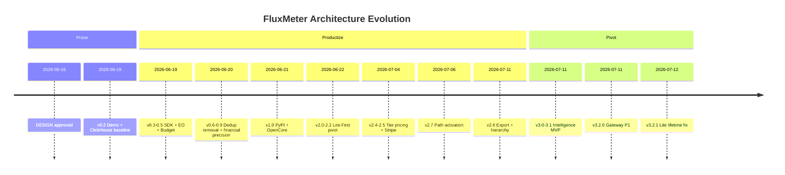

# FluxMeter Architecture Decision Records (ADR)

**Version anchor:** Engine 3.2.1 · Python SDK 1.5.0  
**Coverage:** 2026-06-16 → 2026-07-12  
**Evidence priority:** git commit log > changLog.md > progress.md > DESIGN.md

**中文:** [README](../zh/README.md)

---

## Summary

In 26 days FluxMeter evolved from a **Weekend Rocket** (1M eps Flink demo) to a **dual-pillar AI Monetization Platform**. Three convergences: **Prove** → **Productize** → **Pivot**. Git log is more honest than design docs — priorities live in commits.

---

## Decision Index

| ID | Title | Status | Version |
|----|-------|--------|---------|
| [ADR-001](001-streaming-first-no-store-then-query.md) | Streaming-First, Reject Store-then-Query | Accepted | 0.1.0 |
| [ADR-002](002-java-engine-python-interface.md) | Java Engine + Python Interface (Hybrid Stack) | Accepted | 0.1.0 |
| [ADR-003](003-window-aggregate-before-redis.md) | Window Aggregate Before Redis Writes | Accepted | 0.1.0 |
| [ADR-004](004-clickhouse-honest-baseline.md) | ClickHouse as Honest Baseline | Accepted | 0.2.0 |
| [ADR-005](005-multi-provider-event-schema.md) | Multi-Provider Event Schema Up Front | Accepted | 0.3.0 |
| [ADR-006](006-incremental-aggregate-function.md) | Incremental AggregateFunction | Accepted | 0.4.0 |
| [ADR-007](007-two-layer-enforcement.md) | Two-Layer Enforcement | Accepted | 0.6.0 |
| [ADR-008](008-three-layer-resilient-budget-check.md) | Three-Layer Resilient Budget Check | Accepted | 0.9.1 |
| [ADR-009](009-financial-precision-microdollars-sha256.md) | Financial Precision: Microdollars + SHA-256 | Accepted | 1.0.0-rc1 |
| [ADR-010](010-exactly-once-remove-dedup-operator.md) | Exactly-Once Composition and Dedup Removal | Accepted (reversal) | 0.6.2 / 2.7.1 |
| [ADR-011](011-reserve-reconcile-single-path-billing.md) | Reserve/Reconcile Single-Path Billing | Accepted | 1.2.0 |
| [ADR-012](012-apache-2-opencore-layout.md) | Apache 2.0 + OpenCore Layout | Accepted | 1.1.0 |
| [ADR-013](013-lite-first-dual-path.md) | Lite-First Dual Path | Accepted (reversal) | 2.0.2 |
| [ADR-014](014-lite-atomic-lua-aggregator.md) | Lite Atomic Lua Aggregator | Accepted | 2.1.0 |
| [ADR-015](015-external-pricing-catalog.md) | External Pricing Catalog | Accepted | 2.4.0 |
| [ADR-016](016-complement-dont-replace.md) | Complement, Don't Replace | Accepted | 2.8.0 |
| [ADR-017](017-path-activation.md) | Path Activation | Accepted | 3.2.0 |
| [ADR-018](018-hierarchical-budgets.md) | Hierarchical Budgets | Accepted | 2.8.0 |
| [ADR-019](019-intelligence-pivot-layer-4.md) | Intelligence Pivot (Layer 4) | Accepted (reversal) | 3.0.0 |
| [ADR-020](020-intelligence-reads-redis-rollups.md) | Intelligence Reads Redis Rollups | Accepted | 3.0.0 |
| [ADR-021](021-gateway-as-side-track.md) | Gateway as Side Track | Accepted | 3.2.0 |
| [ADR-022](022-major-version-narrative-shift.md) | Major Version = Narrative Shift | Accepted | 3.0.0 |
| [ADR-023](023-phase-7-demand-gated.md) | Phase 7+ Demand-Gated | Accepted | 3.1.0 |
| [ADR-024](024-single-http-kafka-flink-path.md) | Single HTTP → Kafka → Flink Path | Accepted | 4.0.0 |
| [ADR-025](025-auditable-clickhouse-cold-store.md) | Auditable ClickHouse Cold Store | Accepted | 4.4.0 |
---

## Evolution Timeline

### Key Commits

| Date | Commit | Decision |
|------|--------|----------|
| 2026-06-21 | `81968fd` | ADR-001/002/003 origin |
| 2026-06-20 | changLog 0.6.2 | ADR-010 dedup removal |
| 2026-06-22 | `66a1c70`–`682ae1a` | ADR-013 Lite-First |
| 2026-07-06 | `7d8ad82` | ADR-017 wrap/webhook |
| 2026-07-11 | `36eef03` | ADR-019 positioning |
| 2026-07-11 | `83d23ca` | ADR-019/021 bundle |
| 2026-07-12 | `0be0827` | ADR-014 rollup fix |

---

## Decision Patterns

1. **Prove → Productize → Pivot** — 1M eps builds credibility; Lite lowers the bar; Intelligence finds L4 blue ocean.
2. **Delete to scale** — ADR-010: removing dedup/allowedLateness mattered more than adding OptimizedRedisSink.
3. **Financial ops are non-negotiable** — Lua atomicity, microdollars, reconciliation are ship gates.
4. **Complement strategy** — own Runtime + Decision, not Invoice SoR.
5. **Ponytail engineering ethics** — MVP heuristics must document ceiling + upgrade path.
6. **Git log beats DESIGN** — cross-reference commits when reading ADRs.
7. **Dual-path is a product decision** — Lite/Full are two deployment profiles of one product.

---

## Explicit Non-Goals

| Non-goal | Reason |
|----------|--------|
| Replace Langfuse/Helicone as trace SoR | L2 crowded; overlay sufficient |
| Replace Metronome/Orb/Stripe as Invoice SoR | L3 red ocean; export coexistence |
| PyFlink rewrite | Rejected in ADR-002 |
| Freeze metering engine | Dual-pillar; Pillar A maintained |

---

## References

- [DESIGN.md](../DESIGN.md) · [changLog.md](../../changLog.md) · [ROADMAP.md](../../ROADMAP.md)
- [industry-billing-research-2026.md](../industry-billing-research-2026.md)
- [strategic-positioning-2026.md](../strategic-positioning-2026.md)

*Last updated: 2026-07-12*
