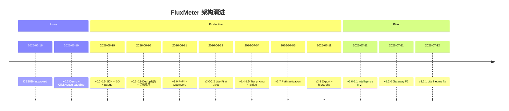

# FluxMeter 架构决策记录（ADR）

**版本锚点：** Engine 3.2.1 · Python SDK 1.5.0  
**覆盖区间：** 2026-06-16 → 2026-07-12  
**证据优先级：** git commit log > changLog.md > progress.md > DESIGN.md

**English:** [README](../en/README.md)

---

## 摘要

FluxMeter 在 26 天内从 **Weekend Rocket**（1M eps Flink Demo）演进为 **双柱 AI Monetization Platform**。三轮收敛：**Prove** → **Productize** → **Pivot**。Git log 比设计文档更诚实 — 优先级写在 commit 里。

---

## 决策索引

| ID | 标题 | Status | 版本 |
|----|------|--------|------|
| [ADR-001](001-streaming-first-no-store-then-query.md) | 流式优先，拒绝 Store-then-Query | Accepted | 0.1.0 |
| [ADR-002](002-java-engine-python-interface.md) | Java 引擎 + Python 界面（混合栈） | Accepted | 0.1.0 |
| [ADR-003](003-window-aggregate-before-redis.md) | 窗口聚合后再写 Redis | Accepted | 0.1.0 |
| [ADR-004](004-clickhouse-honest-baseline.md) | ClickHouse 作为诚实对照组 | Accepted | 0.2.0 |
| [ADR-005](005-multi-provider-event-schema.md) | 多 Provider 事件 Schema 一次到位 | Accepted | 0.3.0 |
| [ADR-006](006-incremental-aggregate-function.md) | Incremental AggregateFunction | Accepted | 0.4.0 |
| [ADR-007](007-two-layer-enforcement.md) | 双层 Enforcement | Accepted | 0.6.0 |
| [ADR-008](008-three-layer-resilient-budget-check.md) | 三层弹性 Budget Check | Accepted | 0.9.1 |
| [ADR-009](009-financial-precision-microdollars-sha256.md) | 金融精度：microdollars + SHA-256 | Accepted | 1.0.0-rc1 |
| [ADR-010](010-exactly-once-remove-dedup-operator.md) | Exactly-Once 组合与 Dedup 删除 | Accepted（反转） | 0.6.2 / 2.7.1 |
| [ADR-011](011-reserve-reconcile-single-path-billing.md) | Reserve/Reconcile 单路径扣费 | Accepted | 1.2.0 |
| [ADR-012](012-apache-2-opencore-layout.md) | Apache 2.0 + OpenCore 分层 | Accepted | 1.1.0 |
| [ADR-013](013-lite-first-dual-path.md) | Lite-First 双路径 | Accepted（反转） | 2.0.2 |
| [ADR-014](014-lite-atomic-lua-aggregator.md) | Lite 原子 Lua 聚合器 | Accepted | 2.1.0 |
| [ADR-015](015-external-pricing-catalog.md) | 外部 Pricing Catalog | Accepted | 2.4.0 |
| [ADR-016](016-complement-dont-replace.md) | Complement, Don't Replace | Accepted | 2.8.0 |
| [ADR-017](017-path-activation.md) | Path Activation | Accepted | 3.2.0 |
| [ADR-018](018-hierarchical-budgets.md) | 层级预算 | Accepted | 2.8.0 |
| [ADR-019](019-intelligence-pivot-layer-4.md) | Intelligence Pivot（Layer 4） | Accepted（反转） | 3.0.0 |
| [ADR-020](020-intelligence-reads-redis-rollups.md) | Intelligence 读 Redis Rollups | Accepted | 3.0.0 |
| [ADR-021](021-gateway-as-side-track.md) | Gateway 作为 Side Track | Accepted | 3.2.0 |
| [ADR-022](022-major-version-narrative-shift.md) | Major Version = 叙事变更 | Accepted | 3.0.0 |
| [ADR-023](023-phase-7-demand-gated.md) | Phase 7+ Demand-Gated | Accepted | 3.1.0 |
| [ADR-024](024-single-http-kafka-flink-path.md) | 单一 HTTP → Kafka → Flink 路径 | Accepted | 4.0.0 |
| [ADR-025](025-auditable-clickhouse-cold-store.md) | 可审计 ClickHouse 冷存储 | Accepted | 4.4.0 |
---

## 演进时间线

### 关键 Commit 对照

| 日期 | Commit | 决策意义 |
|------|--------|----------|
| 2026-06-21 | `81968fd` | ADR-001/002/003 起点 |
| 2026-06-20 | changLog 0.6.2 | ADR-010 Dedup 删除 |
| 2026-06-22 | `66a1c70`–`682ae1a` | ADR-013 Lite-First |
| 2026-07-06 | `7d8ad82` | ADR-017 wrap/webhook |
| 2026-07-11 | `36eef03` | ADR-019 战略定位 |
| 2026-07-11 | `83d23ca` | ADR-019/021 bundle |
| 2026-07-12 | `0be0827` | ADR-014 rollup fix |

---

## 决策模式复盘

1. **Prove → Productize → Pivot** — 1M eps 是 credibility 底座，Lite 降门槛，Intelligence 找 L4 蓝海。
2. **Delete to scale** — ADR-010：删 Dedup/allowedLateness 比加 OptimizedSink 更关键。
3. **Financial ops 不容妥协** — Lua 原子性、microdollars、reconciliation 是 ship 门槛。
4. **Complement 战略** — 争 Runtime + Decision，不争 Invoice SoR。
5. **Ponytail 工程伦理** — MVP 启发式须标注 ceiling + upgrade path。
6. **Git log 比 DESIGN 更真实** — cross-reference commits 读 ADR。
7. **Dual-Path 是产品决策** — Lite/Full 是同一产品的两个 deployment profile。

---

## 显式非目标

| 非目标 | 原因 |
|--------|------|
| 替换 Langfuse/Helicone 作为 trace SoR | L2 crowded；overlay 足够 |
| 替换 Metronome/Orb/Stripe 作为 Invoice SoR | L3 red ocean；export 共生 |
| PyFlink rewrite | ADR-002 已拒绝 |
| 冻结 metering engine | 双柱模型；Pillar A maintained |

---

## 参考文献

- [DESIGN.md](../DESIGN.md) · [changLog.md](../../changLog.md) · [ROADMAP.md](../../ROADMAP.md)
- [industry-billing-research-2026.md](../industry-billing-research-2026.md)
- [strategic-positioning-2026.md](../strategic-positioning-2026.md)

*Last updated: 2026-07-12*
