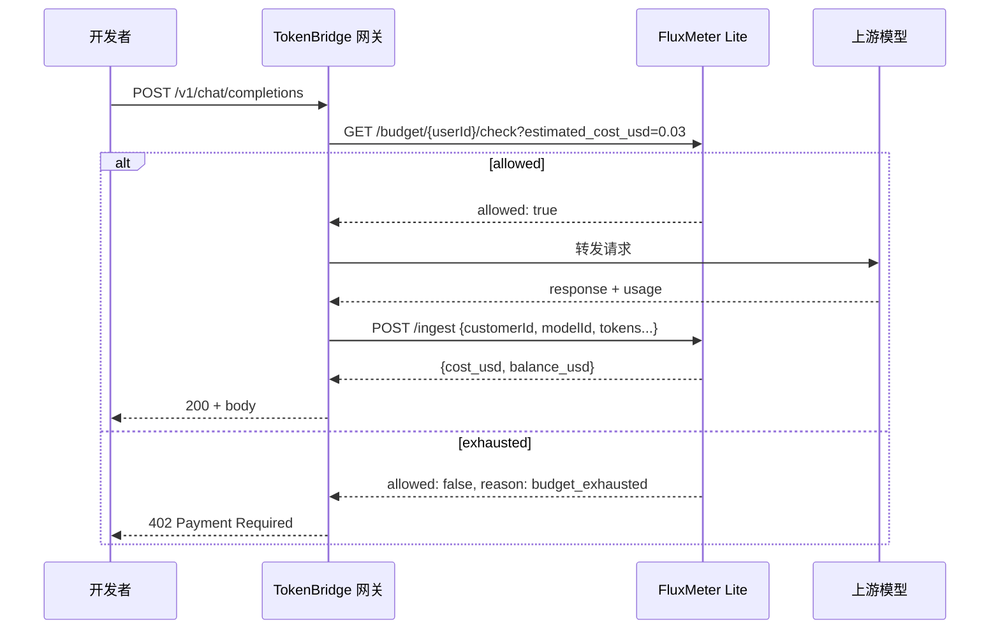
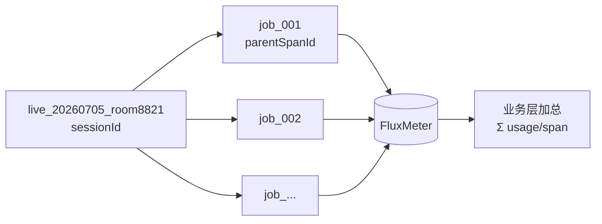
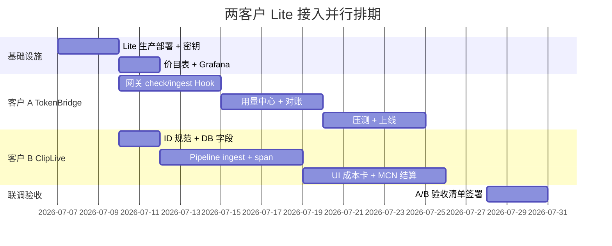

# 客户故事与 Use Case — Lite 模式实施方案

**FluxMeter v2.6.2** · Lite 路径（Redis + API，无 Flink）  
**配套工程文档：** [customer-integration-lite.md](customer-integration-lite.md) · [api-reference.md](api-reference.md)

本文档以 SaaS 产品官网「客户故事 / Use Case」的结构组织，并附**可执行的详细实施方案**（环境、接口、排期、验收）。可直接用于对内交付、对外售前或官网 `Customers` 栏目素材。

---

# 客户 A · TokenBridge（AI API 中转站）

> **一句话：** 在每一次 LLM 调用发生之前，就知道用户还有没有额度——而不是月底对账时才发现亏了几万块。

---

## 客户画像

| 项 | 内容 |
|----|------|
| **公司类型** | B2B AI 基础设施 / OpenAI 兼容 API 聚合网关 |
| **产品** | 对外提供 `/v1/chat/completions`，路由 OpenAI、DeepSeek、Qwen、Claude 等 |
| **用户规模** | 初期 200+ 下游开发者，峰值 3K–8K RPM |
| **商业模式** | 预付费 Token 包 + 按模型差异化单价；少量企业 USD 账户 |
| **技术栈** | Go/Node 网关、PostgreSQL 用户库、现有支付宝/Stripe 收款 |
| **决策人** | 创始人 + 后端 Tech Lead |

### 人物：李明 · 后端负责人

> 「我们卖 Token 包，用户余额归零后网关还在转发上游——上个月有用户透支跑了 $2,000 的 Opus，我们全赔。Stripe 账单 T+1 才到，根本拦不住。」

---

## 痛点 → 目标

| Before（没有 FluxMeter） | After（Lite 接入后） |
|--------------------------|----------------------|
| 余额在业务 DB，和真实 token 消耗异步对账 | 每次请求前 **<10ms** 预算闸门 |
| 多模型成本手工乘系数，经常算错 | 统一价目表 + 自动 `cost_usd` |
| 重复回调 / 重试导致重复扣费争议 | `eventId` 幂等，10 分钟内去重 |
| 只有月总账，用户问「为什么今天花了 50 块」答不上来 | 日/月/分模型 API 即查 |
| 想卖 Token 包但只能按 USD 估 | 原生 Token 包扣减 |

**成功指标（上线 90 天）：**

- 透支导致的平台损失 → **0**
- 用户余额争议工单 → 下降 **80%**
- `/check` p99 延迟 → **<15ms**（网关内网）
- 计量丢失率 → **<0.01%**（ingest WAL + 幂等）

---

## Use Case 一览

### UC-A1 · 预付费 Token 包

**角色：** 下游开发者  
**故事：** 小王购买「1000 万 Token 包」，绑定 API Key 后开始调模型；包用完瞬间收到 402，不会出现负余额。

```
用户充值 → Admin 写 package → 每次 ingest 扣 token 包
         → 耗尽 → check/ingest 拒绝 → 引导续费
```

**FluxMeter 接口：**

```bash
POST /budget/user_wang/package   {"tokens": 10000000}
GET  /budget/user_wang/package   → tokens_remaining
GET  /budget/user_wang/check     → allowed + 余额
```

---

### UC-A2 · 实时网关拦截

**角色：** 网关服务  
**故事：** 每条 `/v1/chat/completions` 在转发上游之前，网关问 FluxMeter「这位用户还能不能花？」



---

### UC-A3 · 分模型定价与转售

**角色：** 运营 / 财务  
**故事：** GPT-4o 对客 $3/$12 per M，DeepSeek 对客 $0.2/$0.4 per M；价目表一改，新请求立即生效。

- 维护 `config/pricing-reseller.json`（或在 Admin API 热更新）
- `GET /usage/customer/{id}/model/gpt-4o` 给用户看单模型消耗

---

### UC-A4 · 开发者用量中心

**角色：** 下游开发者（自助）  
**故事：** 用户在控制台查看「本月用了多少 Token、哪个模型最贵、今天花了多少」。

| 控制台页面 | FluxMeter API |
|------------|---------------|
| 账户余额 | `GET /budget/{id}` |
| 本月用量 | `GET /usage/customer/{id}/period/2026-07` |
| 今日用量 | `GET /usage/customer/{id}/day/2026-07-05` |
| 模型明细 | `GET /usage/customer/{id}/model/{model}` |

---

### UC-A5 · 风控 RPM 限流

**角色：** 平台风控  
**故事：** 免费试用账号限制 60 RPM，防止单用户打满上游配额。

```bash
POST /budget/{id}  {"balance_usd": 5, "max_rpm": 60}
# check 返回 reason: rate_limited
```

---

## 客户 A · 详细实施方案

### 阶段 0：准备（第 1 周前 2 天）

| 任务 | 负责人 | 产出 |
|------|--------|------|
| 部署 Lite 生产栈 | 运维 | Redis(AOF) + API×2 + LB + Grafana |
| 配置密钥与 fail-closed | 运维 | `FLUXMETER_*_KEY`, `BUDGET_FAIL_POLICY=closed` |
| 定制价目表 | 产品/财务 | `pricing-reseller.json` |
| 定义 `customerId` 规范 | 后端 | `user_{uuid}` 与用户表 1:1 |

**环境变量清单：**

```env
FLUXMETER_LITE_MODE=true
FLUXMETER_AUTH_OPTIONAL=false
FLUXMETER_API_KEY=fm_global_...
FLUXMETER_ADMIN_KEY=fm_admin_...
REDIS_PASSWORD=...
BUDGET_FAIL_POLICY=closed
PRICING_FILE=/config/pricing-reseller.json
```

---

### 阶段 1：网关嵌入（第 1 周）

**改造点：** 在现有 OpenAI 兼容网关增加两个 Hook，**不替换**上游调用逻辑。

#### Hook 1 — Pre-flight（同步，关键路径）

```typescript
// middleware/budgetGate.ts
export async function budgetGate(userId: string, model: string): Promise<void> {
  const est = estimateCost(model); // 本地粗估，或固定 0.05
  const res = await fetch(
    `${FM_URL}/budget/${userId}/check?estimated_cost_usd=${est}`,
    { headers: { "X-API-Key": FM_API_KEY }, signal: AbortSignal.timeout(50) },
  );
  const gate = await res.json();
  if (!gate.allowed) {
    throw new PaymentRequiredError(gate.reason); // → HTTP 402
  }
}
```

#### Hook 2 — Post-call（可异步）

```typescript
// after upstream response
await meter.trackOpenAI(userId, upstreamJson, {
  latencyMs: Date.now() - t0,
});
// eventId = upstream.id 保证幂等
```

**开户流程（用户注册 / 充值时）：**

```bash
# 1. 新用户注册
POST /budget/user_{id}  {"balance_usd": 0, "max_rpm": 60}

# 2. 用户购买 Token 包（支付回调后）
POST /budget/user_{id}/package  {"tokens": 5000000}

# 或 USD 充值
POST /budget/user_{id}/topup?amount_usd=50
```

---

### 阶段 2：控制台与对账（第 2 周）

| 模块 | 实现 |
|------|------|
| 用户「用量中心」 | 后端代理 FluxMeter `GET /usage/*`（勿暴露 Admin Key 给前端） |
| 运营对账脚本 | 每小时 cron：`GET /usage/global` + 抽样用户 vs 业务订单 |
| Grafana | 导入现有 dashboard，看 `global:total_cost_usd`、模型分布 |

**对账脚本伪代码：**

```python
for user_id in active_users_today():
    usage = fm.get(f"/usage/customer/{user_id}/day/{today}")
    order = db.get_recharges(user_id, today)
    assert usage["cost_usd"] <= order.prepaid + opening_balance  # 业务规则
```

---

### 阶段 3：压测与上线（第 3–4 周）

| 项 | 目标 | 方法 |
|----|------|------|
| `/check` 延迟 | p99 < 15ms | k6 / wrk，网关与 FM 同 VPC |
| ingest 吞吐 | 峰值 RPM × 1.5 | 异步 batch，1000 条/批 |
| 幂等 | 重试不双计 | 同一 `eventId` 打两次 |
| 故障 | Redis 挂 → 拒绝新请求 | `BUDGET_FAIL_POLICY=closed` |

**ingest 可靠性（ponytail 必做）：**

```
ingest 失败 → 写本地 SQLite WAL → 后台每 5s flush 到 /ingest/batch
```

---

### 客户 A · 验收清单

- [ ] 余额为 0 的用户收到 402，上游未被调用
- [ ] Token 包耗尽后 ingest 返回 `package_exhausted`
- [ ] 同一 `chatcmpl-xxx` 重试 ingest 只计一次
- [ ] 控制台「本月用量」与 FluxMeter period API 一致
- [ ] 压测峰值下无计量丢失（WAL 回放后一致）
- [ ] 生产 auth 开启，无 key 请求 401

---

# 客户 B · ClipLive（直播 AI 短视频剪辑）

> **一句话：** 一场直播、一条剪辑流水线花了多少 AI 成本——对创作者透明，对 MCN 可结算。

---

## 客户画像

| 项 | 内容 |
|----|------|
| **公司类型** | 直播 SaaS + AIGC 工具 |
| **产品** | 主播下播后自动生成高光短视频（转写 → 打点 → 文案 → 封面 prompt） |
| **用户规模** | 50+ MCN，3000+ 创作者，日均 800–2000 条剪辑任务 |
| **商业模式** | 创作者月卡 / 按条计费；MCN 批量采购 |
| **技术栈** | Python 任务队列（Celery/RQ）、对象存储、自研剪辑 UI |
| **决策人** | 产品总监 + AI 流水线负责人 |

### 人物：陈薇 · AI 流水线 Tech Lead

> 「一条剪辑要调 4–6 次模型，以前只知道整场直播『大概』花了多少钱。创作者投诉『为什么这条 clip 扣我 3 块』，我们查不到。」

---

## 痛点 → 目标

| Before | After |
|--------|-------|
| 成本只到「创作者「月度」粒度 | 每条剪辑任务 `GET /usage/span/{job_id}` |
| 多步骤 LLM 成本散落日志 | 统一 `parentSpanId` 聚合 |
| 套餐用完仍提交任务，完成后才发现欠费 | 任务启动前 `/check` |
| MCN 结算靠 Excel 估 | `GET /usage/customer/{id}/period/{YYYY-MM}` |

**成功指标（上线 90 天）：**

- 单条剪辑成本可查率 → **100%**
- 创作者成本争议 → 下降 **70%**
- 任务级成本与财务抽样误差 → **<2%**
- 流水线不因计量增加 → 单步延迟 **+0ms**（ingest 异步）

---

## Use Case 一览

### UC-B1 · 单次剪辑任务成本卡

**角色：** 创作者  
**故事：** 用户在 App 里点开「这条短视频」，看到 AI 成本明细：转写 $0.08、高光 $0.22、标题 $0.01，合计 **$0.31**。

```
job_id = job_a1b2c3
流水线每步 ingest 时 parentSpanId = job_id
完成后 GET /usage/span/job_a1b2c3
```

**API 响应示例：**

```json
{
  "span_id": "job_a1b2c3",
  "customer_id": "creator_liwei",
  "total_tokens": 142000,
  "call_count": 4,
  "cost_usd": 0.31,
  "duration_ms": 45000
}
```

---

### UC-B2 · 直播场次级汇总

**角色：** MCN 运营  
**故事：** 一场 3 小时直播生成了 12 条 clip，运营要看「这场直播 total AI 成本」。



**实现模式：**

- 业务 DB：`live_sessions` 表存 `live_id → [job_id...]`
- 结算时：`sum(GET /usage/span/{job_id}.cost_usd for job in jobs)`
- 可选：直播元数据 ingest 时带 `sessionId=live_{id}`（场次维度，与 job 分离）

---

### UC-B3 · 创作者套餐与任务门禁

**角色：** 创作者 / 计费  
**故事：** 月卡用户每月 $20 AI 额度；提交剪辑前检查，额度不足引导升级。

```python
def start_clip_job(creator_id: str, live_id: str) -> str:
    gate = fm.check(creator_id, estimated_cost_usd=0.50)
    if not gate["allowed"]:
        raise QuotaExceeded(gate["reason"])
    job_id = f"job_{uuid4().hex[:12]}"
    db.jobs.insert(creator_id, live_id, job_id)
    queue.enqueue(run_pipeline, creator_id, job_id, live_id)
    return job_id
```

---

### UC-B4 · 多模型流水线

**角色：** AI 流水线  
**故事：** 一条 clip 依次调用 Whisper 类 ASR → GPT-4o 高光 → GPT-4o-mini 标题，每步完成后计量。

| 步骤 | modelId | parentSpanId | 说明 |
|------|---------|--------------|------|
| ASR | `whisper-1` 或自建名 | `job_xxx` | inputTokens = 音频 token 估算 |
| 高光 | `gpt-4o` | `job_xxx` | 字幕+时间轴进 prompt |
| 标题 | `gpt-4o-mini` | `job_xxx` | 短 completion |
| 封面 prompt | `claude-haiku-4` | `job_xxx` | 可选 |

```python
def ingest_step(creator_id, job_id, model, inp, out, step):
    httpx.post(f"{FM}/ingest", json={
        "customerId": creator_id,
        "modelId": model,
        "parentSpanId": job_id,
        "spanId": f"{job_id}:{step}",
        "sessionId": f"live_{live_id}",  # 可选：场次
        "inputTokens": inp,
        "outputTokens": out,
        "eventId": str(uuid4()),
        "requestId": f"{job_id}|{step}",
    }, headers=HEADERS)
```

---

### UC-B5 · MCN 月度结算

**角色：** 财务  
**故事：** 月底导出每个创作者当月 AI 总成本，与 MCN 合同对账。

```bash
GET /usage/customer/creator_liwei/period/2026-07
# → {total_tokens, cost_usd, event_count, ...}
```

可并行对接 Stripe / 内部 ERP（见 [integrations.md](integrations.md)）。

---

### UC-B6 · 非 Token 成本（边界说明）

**角色：** 产品  
**故事：** 视频渲染、CDN、存储的费用不在 FluxMeter 内。

| 成本类型 | 记录位置 | 展示 |
|----------|----------|------|
| LLM Token | FluxMeter | 「AI 推理 $0.31」 |
| GPU 渲染 | 业务 DB | 「渲染 $0.05」 |
| 存储/流量 | 业务 DB / 云账单 | 「存储 $0.02」 |
| **用户看到合计** | 业务 API 聚合 | 「本条 clip 总成本 $0.38」 |

---

## 客户 B · 详细实施方案

### 阶段 0：领域模型（第 1 周前 2 天）

**ID 规范（写入团队 Confluence / ADR）：**

| ID | 格式 | 示例 | FluxMeter 字段 |
|----|------|------|----------------|
| 创作者 | `creator_{slug}` | `creator_liwei` | `customerId` |
| 直播场次 | `live_{date}_{roomId}` | `live_20260705_8821` | `sessionId` |
| 剪辑任务 | `job_{12hex}` | `job_a1b2c3d4e5f6` | `parentSpanId` |
| 流水线步骤 | `{job_id}:{step}` | `job_xxx:asr` | `spanId` / `requestId` |

**数据库补充（业务侧，非 FluxMeter）：**

```sql
ALTER TABLE clip_jobs ADD COLUMN flux_job_id VARCHAR(32) NOT NULL;
ALTER TABLE clip_jobs ADD COLUMN ai_cost_usd DECIMAL(10,6);
ALTER TABLE live_sessions ADD COLUMN flux_session_id VARCHAR(64);
```

---

### 阶段 1：流水线嵌入（第 1–2 周）

```mermaid
flowchart TB
    subgraph ClipLive
        API[任务 API]
        Q[任务队列]
        PL[Pipeline Worker]
    end
    subgraph FluxMeter Lite
        CHK[/budget/check]
        ING[/ingest]
        SPAN[/usage/span]
    end

    API --> CHK
    CHK -->|allowed| Q
    Q --> PL
    PL -->|每步 LLM 后| ING
    PL -->|任务结束| SPAN
    SPAN -->|写回 ai_cost_usd| API
```

**Worker 改造 checklist：**

1. [ ] 任务创建：生成 `job_id`，写 DB
2. [ ] 任务开始：`check(estimated=0.50)`
3. [ ] 每个 LLM 步骤后：异步 `POST /ingest`（不阻塞流水线）
4. [ ] 任务成功：`GET /usage/span/{job_id}` → 更新 `clip_jobs.ai_cost_usd`
5. [ ] 任务失败：仍保留已 ingest 步骤成本（真实消耗）

**异步 ingest 队列（推荐）：**

```python
# ponytail: 内存 queue + 单线程 batch flush，失败写 disk
ingest_queue.put(event)
# flush thread: every 2s or 100 events → POST /ingest/batch
```

---

### 阶段 2：产品 UI（第 2–3 周）

| 页面 | 数据来源 |
|------|----------|
| 创作者「本月 AI 用量」 | `GET /usage/customer/{id}/period/{month}` |
| 单条 clip 详情卡 | `clip_jobs.ai_cost_usd` + 可选分步日志 |
| MCN 看板 | 聚合旗下所有 `creator_*` 的 period API |
| 套餐余量 | `GET /budget/{id}` |

**UI 文案示例：**

> 本条短视频 AI 成本 **¥2.24**（含转写、高光分析、文案生成）  
> 本月已用 **¥18.60** / 套餐 **¥50.00**

---

### 阶段 3：MCN 结算与上线（第 3–4 周）

| 任务 | 说明 |
|------|------|
| 月底结算脚本 | 遍历创作者 → period API → 写 ERP |
| 抽样审计 | 10 条 job：手工加各步 token × 单价 ≈ span.cost_usd |
| 创作者 onboarding | 注册时 `POST /budget/{creator_id}` 初始化套餐 |
| 告警 | 余额 < 阈值：轮询 `/budget/{id}` 或解析 ingest 的 `budget_alert` |

---

### 客户 B · 验收清单

- [ ] 任意 completed job 在 UI 展示 `cost_usd`，与 `GET /usage/span/{job_id}` 一致
- [ ] 4 步流水线 `call_count=4`，`total_tokens` 为各步之和
- [ ] 余额不足时任务**创建**被拒绝（非完成后才发现）
- [ ] 一场直播 N 条 job，MCN 看板加总误差 < 2%
- [ ] ingest 失败不影响 clip 产出，WAL 回放后成本补全
- [ ] 非 token 成本在 UI 与 AI 成本分开展示

---

# 两客户对比 · 选型速查

| 维度 | TokenBridge（A） | ClipLive（B） |
|------|------------------|---------------|
| **核心场景** | API 网关卖 Token | 异步 Job 卖剪辑 |
| **关键路径** | 同步 check **必须** | 任务级 check 即可 |
| **主键** | `customerId` = 下游用户 | `customerId` = 创作者 |
| **归因** | 模型 / 日 / 月 | `parentSpanId` = 任务 |
| **计费形态** | Token 包 + RPM | USD 月卡 / 按条 |
| **SDK** | JS SDK / httpx | Python httpx |
| **高峰策略** | check 同步 + ingest 异步 | 全异步 ingest |
| **上线周期** | 3–4 周 | 3–4 周 |

---

# 共享实施路线图（4 周并行）



---

# 官网素材 · 可直接引用的 Story 摘要

## TokenBridge

**行业：** AI API 基础设施  
**挑战：** 预付费 Token 产品无法在请求级拦截透支，多模型定价复杂，重试导致重复计费。  
**方案：** FluxMeter Lite 嵌入 OpenAI 兼容网关——每次调用前 budget check，调用后 atomic ingest，Token 包原生扣减。  
**结果：** 透支损失归零；用户自助查日/月/模型用量；网关改造仅两个 Hook，3 周上线。

---

## ClipLive

**行业：** 直播 + AIGC 短视频  
**挑战：** 单条 clip 经过 4–6 次 LLM，成本散落日志，创作者无法核对「这一条多少钱」。  
**方案：** 每条剪辑任务一个 `parentSpanId`，流水线每步异步 ingest，完成后 `GET /usage/span` 回写 UI。  
**结果：** 100% 任务级成本可查；MCN 月度结算对接 period API；计量异步不拖慢剪辑流水线。

---

# 参考与下一步

| 文档 | 用途 |
|------|------|
| [customer-integration-lite.md](customer-integration-lite.md) | 工程细节、curl、缺口 Review |
| [api-reference.md](api-reference.md) | 全量 API |
| [integrations.md](integrations.md) | Stripe / Lago / Orb |
| [production-deploy.md](production-deploy.md) | Redis / API 生产规格 |

**建议下一步：**

1. 与客户 A 确认 Token 包 vs USD 主售卖形态 → 定 pricing 表  
2. 与客户 B 确认 UI 是否展示分步成本 → 决定是否存业务侧 step log  
3. 共用 Lite 集群 or 独立部署 → 若共用，通过不同 `FLUXMETER_ADMIN_KEY` 逻辑租户隔离即可（物理同集群）

---

| 版本 | 日期 | 说明 |
|------|------|------|
| 1.0 | 2026-07-05 | 首版：TokenBridge + ClipLive 客户故事与 4 周实施方案 |
